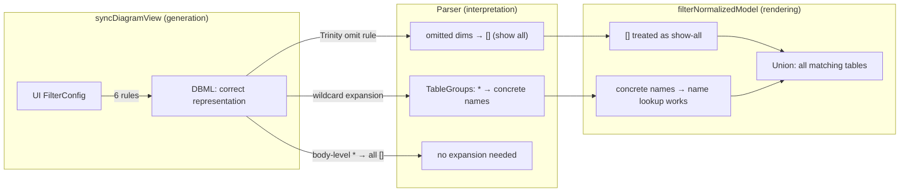
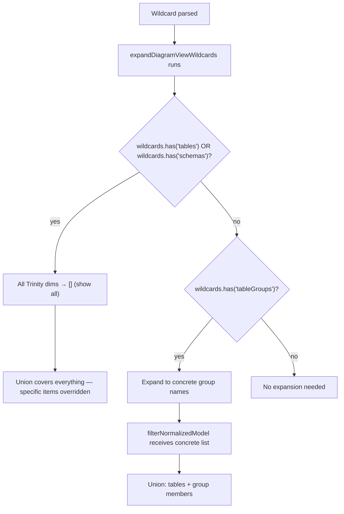
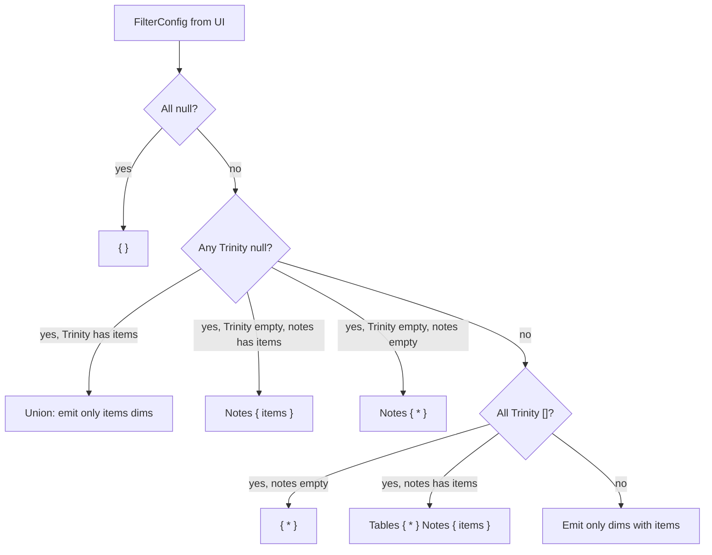

# Solutions: DiagramView Union Semantics Fix

## Overview

Two changes, both in dbml, working together:

1. **syncDiagramView** — follows 6 generation rules to produce correct DBML. Handles legacy null cases and normal cases via omit-empty and union rules. Never emits unnecessary `*` for dimensions the user didn't filter.

2. **expandDiagramViewWildcards** — for human-written DBML with `TableGroups: *`, always expands to concrete group names regardless of sibling dims. Body-level `{ * }` is unaffected.

3. **No dbx-utils changes needed** — expanding TableGroups `*` to concrete names gives `filterNormalizedModel` non-empty arrays, so the existing `hasTableGroupFilters` check correctly returns `true`.

### Round-trip Truth Tables

> Shorthand: `(T, TG, S, N)` = FilterConfig. `n` = null, `[]` = empty array, `[x]` = has items.
> Delta column shows what changed in round-trip (blank = 1:1).

#### Table 1: FilterConfig → DBML → FilterConfig (Generation Stability)

Tests: does `generate(filterConfig)` produce DBML that re-parses back to the same FilterConfig?

| Case | Input FC | → DBML | → FC (re-parse) | Delta |
|------|----------|--------|-----------------|-------|
| **A1** | `n, n, n, n` | `{ }` | `n, n, n, n` | — |
| **A2** | `[T], n, [], []` | `Tables {T}` | `[T], [], [], n` | TG:`n→[]`, N:`[]→n` |
| **A3** | `[T], n, [S], []` | `Tables {T} Schemas {S}` | `[T], [], [S], n` | TG:`n→[]`, N:`[]→n` |
| **A5** | `n, [], [], []` | `Notes { * }` | `n, n, n, []` | TG:`[]→n`, S:`[]→n` |
| **A6** | `[], [], n, []` | `Notes { * }` | `n, n, n, []` | T:`[]→n`, TG:`[]→n` |
| **A7** | `n, [], n, []` | `Notes { * }` | `n, n, n, []` | TG:`[]→n` |
| **A8** | `n, [TG], [S], []` | `TableGroups {TG} Schemas {S}` | `[], [TG], [S], n` | T:`n→[]`, N:`[]→n` |
| **A9** | `[T], [TG], n, []` | `Tables {T} TableGroups {TG}` | `[T], [TG], [], n` | S:`n→[]`, N:`[]→n` |
| **A10** | `n, n, n, []` | `Notes { * }` | `n, n, n, []` | — |
| **B1** | `[], [], [], []` | `{ * }` | `[], [], [], []` | — |
| **B2** | `[T], [], [], []` | `Tables {T}` | `[T], [], [], n` | N:`[]→n` |
| **B3** | `[], [TG], [], []` | `TableGroups {TG}` | `[], [TG], [], n` | N:`[]→n` |
| **B4** | `[], [], [S], []` | `Schemas {S}` | `[], [], [S], n` | N:`[]→n` |
| **B5** | `[T], [], [S], []` | `Tables {T} Schemas {S}` | `[T], [], [S], n` | N:`[]→n` |
| **B6** | `[T], [TG], [], []` | `Tables {T} TableGroups {TG}` | `[T], [TG], [], n` | N:`[]→n` |
| **B7** | `[], [TG], [S], []` | `TableGroups {TG} Schemas {S}` | `[], [TG], [S], n` | N:`[]→n` |
| **B8** | `[T], [TG], [S], []` | `Tables {T} TableGroups {TG} Schemas {S}` | `[T], [TG], [S], n` | N:`[]→n` |
| **C1** | `[], [], [], [N]` | `Tables { * } Notes {N}` | `[], [], [], [N]` | — |
| **C2** | `[T], [], [], [N]` | `Tables {T} Notes {N}` | `[T], [], [], [N]` | — |

**Non-1:1 patterns:**

| Pattern | Cause | Why acceptable |
|---------|-------|----------------|
| N:`[]→n` | When no Notes block emitted, parser leaves stickyNotes as `null` | Both `[]` and `null` mean "don't filter notes" in practice; filterNormalizedModel handles both |
| TG:`n→[]` | Trinity omit: when other Trinity dims are set, omitted tableGroups promoted to `[]` | `null` tableGroups is legacy; after round-trip it becomes `[]` (show all) — functionally equivalent |
| S:`n→[]` / T:`n→[]` | Same Trinity omit rule | Same reason — `null` dims only exist in legacy data |
| T:`[]→n` / TG:`[]→n` / S:`[]→n` | `Notes { * }` generation: only Notes block emitted, no Trinity set → no Trinity omit | Legacy "show only notes" case; empty arrays → null is functionally equivalent |

#### Table 2: DBML → FilterConfig → DBML (Parse Stability)

Tests: does parsing DBML produce a FilterConfig that generates back to the same DBML?

| Case | Input DBML | → FC | → DBML (re-generate) | Delta |
|------|-----------|------|---------------------|-------|
| **D1** | `Tables { users, orders }` | `[T], [], [], n` | `Tables { users, orders }` | — |
| **D2** | `TableGroups { Inv, Rep }` | `[], [TG], [], n` | `TableGroups { Inv, Rep }` | — |
| **D3** | `Schemas { sales }` | `[], [], [S], n` | `Schemas { sales }` | — |
| **D4** | `Tables { users } Schemas { sales }` | `[T], [], [S], n` | `Tables { users } Schemas { sales }` | — |
| **D5** | `Tables { users } TableGroups { Inv }` | `[T], [TG], [], n` | `Tables { users } TableGroups { Inv }` | — |
| **D6** | `TableGroups { Inv } Schemas { sales }` | `[], [TG], [S], n` | `TableGroups { Inv } Schemas { sales }` | — |
| **D7** | All three have items | `[T], [TG], [S], n` | All three blocks | — |
| **E1** | `Tables{T} TableGroups{*} Schemas{S}` | `[T], [TG], [S], n` | `Tables{T} TableGroups{TG} Schemas{S}` | `*` expanded to concrete names |
| **E2** | `Tables { * }` | `[], [], [], n` | `{ * }` | `Tables{*}` → body `{*}` (stickyNotes null) |
| **E3** | `Schemas { * }` | `[], [], [], n` | `{ * }` | `Schemas{*}` → body `{*}` |
| **E4** | `TableGroups { * }` | `[], [TG], [], n` | `TableGroups {TG}` | `*` expanded to concrete names |
| **F1** | `{ * }` | `[], [], [], []` | `{ * }` | — |
| **F2** | `Tables{*} Notes{Note1}` | `[], [], [], [N]` | `Tables{*} Notes{Note1}` | — |
| **G1** | `{ }` (empty body) | `n, n, n, n` | `{ }` | — |
| **G2** | `Tables { }` (empty sub-block) | `n, n, n, n` | `{ }` | `Tables{}` → `{ }` (empty sub-block = all null) |
| **H1** | `Notes { Note1, Note2 }` | `n, n, n, [N]` | `Notes { Note1, Note2 }` | — |

**Non-1:1 patterns:**

| Pattern | Cause | Why acceptable |
|---------|-------|----------------|
| `TableGroups{*}` → concrete names | Wildcard expanded to concrete group names | Expanded form is functionally identical; needed for union semantics |
| `Tables{*}` → body `{*}` | When only `Tables{*}` (no other dims), FC is `[],[],[],n` → all Trinity empty → body-level `{*}` | Semantically equivalent; body `{*}` = show all |
| `Tables{}` → `{ }` | Empty sub-block = all null → generates empty body | Correct — empty block is meaningless, same as no block |

---

## Sub-Problems

### Sub-Problem 1: `expandDiagramViewWildcards` — wildcard expansion rules

**Two wildcard rules:**

1. **Tables `*` or Schemas `*`** → all Trinity dims become `[]` (show all). Union with "show all tables" or "show all schemas" = show everything. Specific items in other dims are overridden.

2. **TableGroups `*`** → expand to concrete group names. Does NOT collapse other dims because not all tables belong to groups — specific items in Tables/Schemas are still meaningful.

**Why the difference:**
- `Tables: *` = show all tables → union with anything = everything
- `Schemas: *` = show all schemas → union with anything = everything
- `TableGroups: *` needs concrete names because some tables DON'T belong to any group. Specific tables/schemas alongside group wildcard still filter meaningfully.

### Sub-Problem 2: `syncDiagramView` — rewrite generation rules

**6 generation rules:**

1. **`tableGroups: null`** → frontend backfills standalone tables into tables array; emit tables as-is, omit tableGroups
2. **`tables: null` or `schemas: null` + rest empty** → `Notes { * }`
3. **`tables: null` or `schemas: null` + rest has items** → union rule, omit null dim
4. **All Trinity `[]`** → body-level `{ * }` (or `Tables { * } + Notes` if notes)
5. **Some items + rest `[]`** → emit only items dims
6. **All items** → emit all

**Safety guarantee:** Trinity omit rule ensures omitted dims → `[]` on re-parse, so omitting `[]` dims is always safe.
