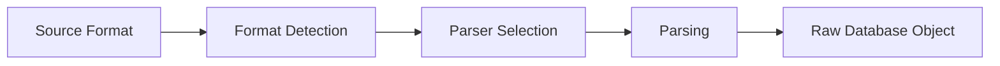
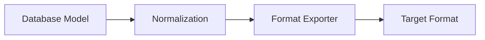
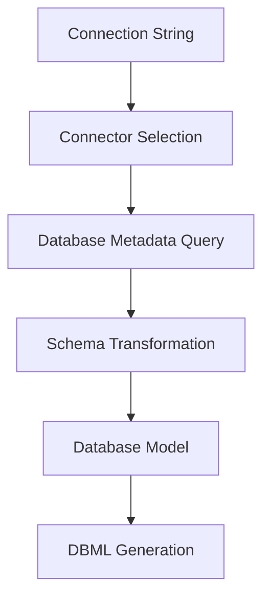

# DBML Architecture

## Overview

DBML (Database Markup Language) is an open-source DSL designed to define and document database schemas in a simple, readable format. The project is structured as a monorepo with multiple packages that provide parsing, transformation, and tooling capabilities for database schema management.

## Project Structure

```
dbml/
├── packages/                    # Core packages
│   ├── dbml-core/              # Main parsing and export engine
│   ├── dbml-parse/             # New modular parsing engine
│   ├── dbml-cli/               # Command-line interface
│   └── dbml-connector/         # Database connection utilities
├── dbml-homepage/              # Documentation website
├── docs/                       # Technical documentation
└── test/                       # Shared test utilities
```

## Core Packages

### @dbml/core
The main package responsible for parsing various database formats and exporting to different targets.

**Key Components:**
- **Parser (`src/parse/Parser.js`)**: Main entry point that dispatches to format-specific parsers
- **Model Structure (`src/model_structure/`)**: Internal representation of database schemas
- **Exporters (`src/export/`)**: Convert internal models to target formats (SQL, JSON, DBML)
- **Importers (`src/import/`)**: Parse input formats into internal models
- **ANTLR Parsers (`src/parse/ANTLR/`)**: Grammar-based parsers for SQL dialects

**Supported Formats:**
- **Input**: DBML, MySQL, PostgreSQL, MSSQL, Snowflake, JSON, SchemaRB
- **Output**: DBML, MySQL, PostgreSQL, MSSQL, Oracle, JSON

### @dbml/parse
New modular parsing engine introduced to replace the legacy PEG.js-based DBML parser.

**Key Components:**
- **Lexer (`src/lib/lexer/`)**: Tokenizes DBML input into syntax tokens
- **Parser (`src/lib/parser/`)**: Builds Abstract Syntax Tree (AST) from tokens
- **Analyzer (`src/lib/analyzer/`)**: Performs semantic analysis and validation
- **Interpreter (`src/lib/interpreter/`)**: Transforms AST to database model
- **Services (`src/services/`)**: Monaco Editor integration for language features

**Pipeline Architecture:**
```
DBML Source → Lexer → Parser → Analyzer → Interpreter → Database Model
```

### @dbml/cli
Command-line interface providing tools for format conversion and database introspection.

**Commands:**
- `dbml2sql`: Convert DBML to SQL DDL
- `sql2dbml`: Convert SQL DDL to DBML
- `db2dbml`: Extract schema from live databases

### @dbml/connector
Database connection utilities for extracting schemas from live databases.

**Supported Databases:**
- PostgreSQL
- MySQL
- Microsoft SQL Server
- BigQuery
- Snowflake

## Data Flow Architecture

### 1. Input Processing


### 2. Internal Representation
The core uses a hierarchical model structure:

```javascript
Database {
  schemas: Schema[]
  tables: Table[]
  enums: Enum[]
  refs: Ref[]
  tableGroups: TableGroup[]
  project: Project
  notes: StickyNote[]
  tablePartials: TablePartial[]
}
```

### 3. Output Generation


## Parsing Pipeline Details

### Legacy DBML Parser (PEG.js)
- Located in `packages/dbml-core/src/parse/dbml/`
- Uses PEG.js grammar for parsing
- Directly outputs raw database objects
- Being phased out in favor of @dbml/parse

### New DBML Parser (@dbml/parse)
- Modular, pipeline-based architecture
- Better error handling and reporting
- Supports advanced IDE features (autocompletion, go-to-definition)
- Enables future language enhancements

**Stage Details:**

1. **Lexical Analysis**: Converts raw text to tokens
2. **Syntax Analysis**: Builds AST from token stream
3. **Semantic Analysis**: Validates syntax and resolves references
4. **Interpretation**: Transforms AST to normalized database model

### SQL Parsers (ANTLR)
- Grammar-based parsing for SQL dialects
- Located in `packages/dbml-core/src/parse/ANTLR/`
- Supports complex DDL constructs
- Generates AST for transformation to DBML model

## Model Architecture

### Element Hierarchy
All database elements inherit from a base `Element` class:

```javascript
Element {
  id: number
  token: Token
  generateId(): void
  export(): Object
  normalize(): Object
}
```

### Key Models
- **Database**: Root container for all schema elements
- **Schema**: Logical grouping of database objects
- **Table**: Table definition with fields and constraints
- **Field**: Column definition with type and constraints
- **Index**: Index specification
- **Ref**: Relationship between tables
- **Enum**: Enumeration type definition
- **TableGroup**: Logical grouping of related tables

### Normalization
The system supports two representation formats:
- **Hierarchical**: Tree-like structure for easy manipulation
- **Normalized**: Flat structure with ID references for efficient serialization

## Export System

### ModelExporter Pattern
Central dispatcher that routes export requests to format-specific exporters:

```javascript
ModelExporter.export(model, format) → {
  'dbml' → DbmlExporter
  'mysql' → MysqlExporter
  'postgres' → PostgresExporter
  'mssql' → SqlServerExporter
  'oracle' → OracleExporter
  'json' → JsonExporter
}
```

### Format-Specific Considerations
- **SQL Exports**: Handle dialect differences in syntax and features
- **DBML Export**: Maintains source formatting and readability
- **JSON Export**: Provides machine-readable representation

## Database Connection Architecture

### Schema Extraction Pipeline


### Metadata Sources
- **PostgreSQL**: `information_schema`, `pg_catalog`
- **MySQL**: `information_schema`
- **MSSQL**: `sys.tables`, `sys.columns`, etc.
- **BigQuery**: BigQuery API
- **Snowflake**: Snowflake SDK

## Error Handling

### Compilation Errors
The new parser introduces structured error reporting:

```javascript
CompileError {
  code: CompileErrorCode
  message: string
  nodeOrToken: SyntaxNode | SyntaxToken
  location: Position
}
```

### Error Recovery
- Graceful degradation in parsing
- Partial AST construction for better IDE support
- Detailed error location information

## Testing Strategy

### Test Categories
- **Unit Tests**: Individual component testing
- **Integration Tests**: End-to-end format conversion
- **Parser Tests**: Grammar and AST validation
- **Database Tests**: Live database integration

### Test Infrastructure
- Jest for JavaScript testing
- Vitest for TypeScript testing
- Snapshot testing for output validation
- GitHub Actions for CI/CD

## Extensibility

### Adding New Formats

1. **Input Format**: Implement parser in `packages/dbml-core/src/parse/`
2. **Output Format**: Create exporter in `packages/dbml-core/src/export/`
3. **CLI Integration**: Update command options in `packages/dbml-cli/`

### Language Features

1. **Lexer Extension**: Add new token types
2. **Grammar Extension**: Update parser rules
3. **Semantic Rules**: Add validation logic
4. **Model Extension**: Update database model structure

## Performance Considerations

### Parsing Performance
- Incremental parsing for large schemas
- Lazy evaluation where possible
- Memory-efficient AST representation

### Export Performance
- Streaming output for large schemas
- Template-based generation
- Caching for repeated operations

## Future Architecture Goals

### Language Server Protocol
The new parsing architecture enables:
- Real-time syntax checking
- Advanced refactoring capabilities
- Cross-file reference resolution

### Plugin System
Potential for extending functionality through:
- Custom validators
- Format-specific transformations
- IDE integrations

### Distributed Processing
Support for:
- Large schema processing
- Parallel format conversion
- Cloud-based schema validation