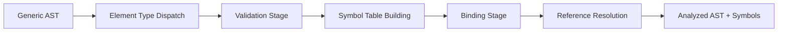

# RFC-20250115: DBML Analyzer Implementation

**Status**: IMPLEMENTED
**Last Updated**: 2025-01-15

## TLDR

The DBML analyzer performs semantic analysis on the generic AST produced by the parser, transforming context-free syntax trees into semantically validated and symbol-linked structures. It implements a two-stage process (Validation → Binding) that enforces element-specific rules, builds symbol tables for IDE services, and resolves all references while maintaining the generic AST structure.

## Concepts

- **Semantic Analysis**: Adding meaning to the generic AST by enforcing element-specific rules and constraints
- **Symbol Table**: Hierarchical mapping of identifiers to their declarations, enabling reference resolution and IDE features
- **Validation**: First stage that checks element-specific rules based on the `type` field (Table constraints, Enum values, etc.)
- **Binding**: Second stage that resolves references between elements and builds cross-reference information
- **Symbol Factory**: Centralized creation of symbol objects with unique IDs for IDE integration
- **Element-Specific Validators**: Specialized validators for each DBML element type (Table, Enum, Ref, etc.)
- **Reference Resolution**: Linking identifiers to their declarations across schema boundaries

## High-level Architecture

The analyzer uses a two-stage pipeline with element-specific dispatch based on the generic AST:



**Design Decisions:**

1. **Two-Stage Analysis**: Validation before binding ensures clean symbol tables and better error messages
2. **Element-Specific Dispatch**: Generic AST nodes are routed to specialized validators based on `type` field
3. **Symbol Table Hierarchy**: Nested symbol tables support schema namespacing and IDE features
4. **Error Accumulation**: Continues analysis after errors to report multiple issues in single pass
5. **Generic AST Preservation**: Maintains original structure while adding semantic annotations
6. **IDE-First Design**: Symbol factory and reference tracking optimized for language services

**Key Innovation**: The analyzer adds semantic meaning to the generic AST without changing its structure, enabling both validation and IDE features through a unified approach.

## Pipeline Architecture Deep Dive

Understanding how the analyzer transforms syntax into semantics:

### Element Type Dispatch
**Purpose**: Route generic AST nodes to specialized analysis based on element type.

**Key Features**:
- Single dispatcher handles all element types
- Dynamic validator selection based on `type` field
- Consistent interface across all element validators

```typescript
// Generic AST node → Element-specific validator
const ElementKind = element.type.value.toLowerCase(); // 'table', 'enum', 'ref'
const Validator = pickValidator(element); // TableValidator, EnumValidator, RefValidator
const validator = new Validator(element, symbolTable, symbolFactory);
```

### Validation Stage
**Purpose**: Enforce element-specific rules and constraints without reference resolution.

**Key Features**:
- Element-specific rule enforcement (Table must have columns, Enum values unique)
- Syntax validation (valid column types, proper setting syntax)
- Name validation and duplication detection
- Setting constraint verification

```typescript
// Table validation example
validateFields(fields) {
  fields.forEach(field => {
    if (!isValidColumnType(field.type)) {
      errors.push(new CompileError('Invalid column type', field));
    }
    if (isDuplicateColumn(field.name)) {
      errors.push(new CompileError('Duplicate column', field));
    }
  });
}
```

### Symbol Table Building
**Purpose**: Create hierarchical symbol tables for reference resolution and IDE features.

**Key Features**:
- Schema-aware symbol organization
- Unique symbol IDs for each declaration
- Parent-child symbol relationships
- Symbol metadata for IDE services

```typescript
// Symbol registration example
const tableSymbol = symbolFactory.create(TableSymbol, {
  declaration: tableNode,
  symbolTable: new SymbolTable() // For columns
});
schemaSymbolTable.set(createTableSymbolIndex(tableName), tableSymbol);
```

### Reference Binding
**Purpose**: Resolve all identifier references to their declarations across the schema.

**Key Features**:
- Cross-element reference resolution (foreign keys, enum types)
- Schema-qualified name resolution
- Partial injection binding (table partials)
- Circular reference detection

```typescript
// Reference resolution example
const referenced = resolveReference(['users', 'id'], symbolTable);
if (referenced.isOk()) {
  createBinding(referenceNode, referenced.unwrap());
} else {
  errors.push(new CompileError('Undefined reference', referenceNode));
}
```

### Symbol Factory and ID Generation
**Purpose**: Centralized symbol creation with consistent ID assignment for IDE integration.

**Key Features**:
- Unique symbol IDs for go-to-definition
- Symbol metadata preservation
- Type-safe symbol creation
- Reference tracking for IDE features

```typescript
// Symbol creation with metadata
const columnSymbol = symbolFactory.create(ColumnSymbol, {
  declaration: columnNode,
  type: resolvedColumnType,
  constraints: extractConstraints(columnNode)
});
```

### Error Accumulation and Recovery
**Purpose**: Continue analysis after errors to provide comprehensive feedback.

**Key Features**:
- Non-fatal error handling
- Context preservation during errors
- Multiple error reporting in single pass
- Detailed error locations and messages

## Detailed Implementation

### Core Analyzer Architecture

**Location**: `packages/dbml-parse/src/lib/analyzer/analyzer.ts`

The analyzer orchestrates validation and binding stages:

```typescript
export default class Analyzer {
  analyze(): Report<ProgramNode, CompileError> {
    const validator = new Validator(this.ast, this.symbolFactory);

    return validator.validate().chain((program) => {
      const binder = new Binder(program);
      return binder.resolve(this.symbolFactory);
    });
  }
}
```

### Element-Specific Validators

**Dynamic Validator Selection**:
```typescript
function pickValidator(element: ElementDeclarationNode) {
  switch (element.type.value.toLowerCase()) {
    case ElementKind.Table: return TableValidator;
    case ElementKind.Enum: return EnumValidator;
    case ElementKind.Ref: return RefValidator;
    case ElementKind.Project: return ProjectValidator;
    // ... more element types
    default: return CustomValidator;
  }
}
```

**Table Validator Example** (`packages/dbml-parse/src/lib/analyzer/validator/elementValidators/table.ts`):
- Validates table name and alias uniqueness
- Checks column definitions and types
- Enforces column constraints (pk, unique, not null)
- Validates indexes and settings
- Registers table and column symbols

**Enum Validator Example**:
- Validates enum name uniqueness
- Checks enum value syntax and uniqueness
- Enforces enum-specific settings
- Registers enum and value symbols

### Symbol Table Architecture

**Hierarchical Structure**:
```typescript
interface SymbolTable {
  // Schema level: contains tables, enums, table groups
  public: {
    users: TableSymbol,
    user_status: EnumSymbol,
    user_group: TableGroupSymbol
  },
  // Nested schemas
  accounting: {
    transactions: TableSymbol,
    // ...
  }
}
```

**Symbol Types**:
- `SchemaSymbol`: Contains nested symbol table for schema elements
- `TableSymbol`: Contains symbol table for columns and indexes
- `ColumnSymbol`: Column metadata and constraints
- `EnumSymbol`: Contains symbol table for enum values
- `TablePartialSymbol`: Partial table definitions for injection

### Binding and Reference Resolution

**Cross-Element Binding** (`packages/dbml-parse/src/lib/analyzer/binder/`):

```typescript
class TableBinder {
  resolveInjections(symbolFactory: SymbolFactory) {
    // Resolve partial injections (~partial_name)
    this.partials.forEach(partial => {
      const partialSymbol = resolvePartialReference(partial.name);
      if (partialSymbol) {
        injectPartialFields(this.tableSymbol, partialSymbol);
      }
    });
  }

  bind() {
    // Resolve foreign key references
    this.inlineRefs.forEach(ref => {
      const targetTable = resolveTableReference(ref.tableName);
      const targetColumn = resolveColumnReference(targetTable, ref.columnName);
      createBinding(ref, targetColumn);
    });
  }
}
```

**Reference Resolution Rules**:
- Simple names resolve within current schema
- Qualified names (`schema.table.column`) resolve across schemas
- Enum type references link columns to enum definitions
- Partial injections merge symbol tables

### Error Handling and Reporting

**Structured Error Types**:
```typescript
enum CompileErrorCode {
  DUPLICATE_NAME = 3001,
  INVALID_COLUMN_TYPE = 3002,
  UNDEFINED_REFERENCE = 3003,
  EMPTY_TABLE = 3018,
  // ... more error codes
}
```

**Error Context Preservation**:
```typescript
errors.push(new CompileError(
  CompileErrorCode.DUPLICATE_NAME,
  `Table name '${tableName}' already exists`,
  tableNameNode, // Precise location
  relatedDeclaration // Additional context
));
```

### Integration Points

**Input Interface**: Consumes generic AST from Parser with syntax errors
**Output Interface**: Produces analyzed AST with symbol tables and semantic errors
**Symbol Export**: Provides symbol information for IDE language services
**Error Aggregation**: Combines validation and binding errors for comprehensive reporting

### Performance Characteristics

- **Time Complexity**: O(n×m) where n is AST size, m is average reference count
- **Space Complexity**: O(n) for symbol tables plus AST preservation
- **Memory Efficiency**: Symbol references shared across bindings
- **IDE Optimization**: Symbol tables optimized for fast lookup and traversal

## Limitations and Known Issues

### Complex Reference Resolution

**Issue**: Nested schema references can create complex resolution paths affecting performance.

**Example**:
```dbml
Ref: deep.nested.schema.table.id > another.deep.schema.table.foreign_id
```

**Impact**: O(depth) lookup time for deeply nested references.

**Mitigation**: Symbol table caching and flattened reference maps for common cases.

### Circular Reference Detection

**Issue**: Complex partial injection cycles may not be detected in all cases.

**Example**:
```dbml
TablePartial A { ~B }
TablePartial B { ~C }
TablePartial C { ~A }  // Circular dependency
```

**Current Approach**: Basic cycle detection; complex transitive cycles may be missed.

### Memory Usage for Large Schemas

**Issue**: Symbol tables for large schemas (1000+ tables) consume significant memory.

**Impact**: Each symbol maintains metadata and references for IDE features.

**Trade-off**: Rich IDE features vs. memory efficiency; current approach prioritizes IDE support.

### Cross-Schema Validation

**Issue**: Some validation rules cannot be enforced across schema boundaries.

**Example**: Foreign key constraints to tables in different schemas may not validate target existence.

**Limitation**: Analyzer focuses on within-schema validation; cross-schema rules are deferred.

### Error Message Quality

**Issue**: Some error messages may not provide sufficient context for complex nested structures.

**Improvement Needed**: Better error message templates with more contextual information.

## Design Evolution

**Original Design (PEG.js)**: Validation integrated into parsing with limited symbol table support.

**Current Design (Separated Analysis)**: Dedicated semantic analysis phase with comprehensive symbol tables and IDE support.

**Key Improvements**:
- **Comprehensive Symbol Tables**: Full support for IDE features (go-to-definition, find references)
- **Error Recovery**: Continues analysis after errors to find multiple issues
- **Extensibility**: New element types require only new validator/binder classes
- **IDE Integration**: Symbol factory and reference tracking designed for language services

**Lessons Learned**:
- Separating validation from binding improves error message quality
- Symbol tables are essential for modern IDE integration
- Element-specific analysis provides better validation than generic rules
- Error accumulation significantly improves developer experience

## Related RFCs
- [RFC-20250115: DBML Parser Implementation](rfc-20250115-dbml-parser.md)
- [RFC-20250115: DBML to JSON Database Model Parser](rfc-20250115-dbml-to-json-parser.md)