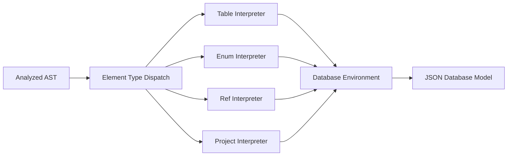

# RFC-20250115: DBML Interpreter Implementation

**Status**: IMPLEMENTED
**Last Updated**: 2025-01-15

## TLDR

The DBML interpreter converts the analyzed generic AST into the specific JSON database model format compatible with the legacy parser output. It implements element-specific interpreters that transform semantic AST nodes into concrete database objects (tables, columns, relationships, etc.) while preserving all metadata and position information for tooling integration.

## Concepts

- **Interpretation**: Final transformation from generic AST to concrete database model format
- **Element Interpreters**: Specialized classes that convert each DBML element type to its JSON representation
- **Database Environment**: Intermediate accumulator that collects interpreted elements before final conversion
- **Legacy Compatibility**: Output format matches the original PEG.js parser for backward compatibility
- **Metadata Preservation**: Position tracking and source information maintained throughout interpretation
- **Type-Specific Processing**: Different processing logic for each database element type (Table, Enum, Ref, etc.)
- **Cross-Reference Resolution**: Converting symbol bindings into concrete object references

## High-level Architecture

The interpreter uses element-specific dispatch to transform analyzed AST into database JSON:



**Design Decisions:**

1. **Element-Specific Interpreters**: Each DBML element type has specialized interpretation logic
2. **Environment Pattern**: Intermediate accumulator collects all elements before final database construction
3. **Legacy Format Compatibility**: Output matches original parser for seamless migration
4. **Metadata Preservation**: All source positions and metadata carried through to final output
5. **Reference Materialization**: Symbol bindings converted to concrete object references
6. **Error Accumulation**: Continues interpretation after errors to process all valid elements

**Key Innovation**: The interpreter bridges the gap between generic semantic analysis and concrete database models, enabling both modern AST-based tooling and legacy JSON compatibility.

## Pipeline Architecture Deep Dive

Understanding how the interpreter transforms semantics into concrete database models:

### Element Type Dispatch
**Purpose**: Route analyzed AST nodes to specialized interpreters based on element type.

**Key Features**:
- Dynamic interpreter selection based on element kind
- Consistent interface across all element interpreters
- Parallel processing of independent elements

```typescript
// Analyzed AST → Element-specific interpreter
switch (getElementKind(element)) {
  case ElementKind.Table: return new TableInterpreter(element, env);
  case ElementKind.Enum: return new EnumInterpreter(element, env);
  case ElementKind.Ref: return new RefInterpreter(element, env);
  // ... more element types
}
```

### Table Interpretation
**Purpose**: Convert table AST nodes into complete table objects with columns, indexes, and constraints.

**Key Features**:
- Column definition processing with type resolution
- Index and constraint interpretation
- Partial injection resolution and field merging
- Primary key composition handling

```typescript
// Table AST → Table JSON
{
  name: "users",
  schemaName: null,
  fields: [
    { name: "id", type: { type_name: "int" }, pk: true },
    { name: "email", type: { type_name: "varchar", args: "255" }, unique: true }
  ],
  indexes: [{ columns: [...], pk: false }],
  token: { start: {...}, end: {...} }
}
```

### Column Processing
**Purpose**: Transform column definitions into detailed column objects with types and constraints.

**Key Features**:
- Complex type parsing (arrays, function calls, enum references)
- Constraint extraction (pk, unique, not_null, default values)
- Inline reference processing (foreign key relationships)
- Setting validation and normalization

```typescript
// Column AST → Column JSON
{
  name: "user_id",
  type: { schemaName: null, type_name: "int", args: null },
  pk: false,
  unique: false,
  not_null: true,
  inline_refs: [
    { tableName: "users", fieldNames: ["id"], relation: ">" }
  ]
}
```

### Reference Interpretation
**Purpose**: Convert relationship AST nodes into concrete reference objects.

**Key Features**:
- Endpoint resolution using symbol table bindings
- Relationship cardinality determination
- Cross-schema reference handling
- Reference ID generation for circular detection

```typescript
// Ref AST → Ref JSON
{
  name: null,
  endpoints: [
    { tableName: "users", fieldNames: ["id"], relation: "1" },
    { tableName: "posts", fieldNames: ["user_id"], relation: "*" }
  ],
  token: { start: {...}, end: {...} }
}
```

### Environment Accumulation
**Purpose**: Collect all interpreted elements in structured environment before final database construction.

**Key Features**:
- Type-safe element storage with Maps
- Reference tracking for circular detection
- Alias and partial management
- Project-level element grouping

```typescript
// Environment structure
{
  tables: Map<ElementDeclarationNode, Table>,
  enums: Map<ElementDeclarationNode, Enum>,
  refs: Map<ElementDeclarationNode, Ref>,
  tableGroups: Map<ElementDeclarationNode, TableGroup>,
  aliases: Alias[],
  project: Map<ElementDeclarationNode, Project>
}
```

### Database Model Construction
**Purpose**: Convert accumulated environment into final JSON database format.

**Key Features**:
- Array conversion from Maps for JSON serialization
- Empty object handling for optional elements
- Schema organization and ordering
- Legacy format compliance

```typescript
// Environment → Database JSON
{
  schemas: [],
  tables: Array.from(env.tables.values()),
  refs: Array.from(env.refs.values()),
  enums: Array.from(env.enums.values()),
  // ... other collections
}
```

## Detailed Implementation

### Core Interpreter Architecture

**Location**: `packages/dbml-parse/src/lib/interpreter/interpreter.ts`

The interpreter orchestrates element-specific interpretation:

```typescript
export default class Interpreter {
  interpret(): Report<Database, CompileError> {
    const errors = this.ast.body.flatMap((element) => {
      switch (getElementKind(element).unwrap_or(undefined)) {
        case ElementKind.Table:
          return new TableInterpreter(element, this.env).interpret();
        case ElementKind.Ref:
          return new RefInterpreter(element, this.env).interpret();
        case ElementKind.Enum:
          return new EnumInterpreter(element, this.env).interpret();
        // ... more element types
        default:
          return [];
      }
    });

    return new Report(convertEnvToDb(this.env), errors);
  }
}
```

### Element Interpreter Pattern

**Consistent Interface**:
```typescript
interface ElementInterpreter {
  interpret(): CompileError[];
}
```

**Table Interpreter** (`packages/dbml-parse/src/lib/interpreter/elementInterpreter/table.ts`):
- Processes table name and schema resolution
- Interprets column definitions with type processing
- Handles index definitions and primary key composition
- Resolves partial injections and field merging
- Manages inline references and foreign key constraints

**Enum Interpreter**:
- Processes enum name and value definitions
- Handles enum-specific settings and notes
- Registers enum symbols for type resolution

**Reference Interpreter**:
- Resolves relationship endpoints using symbol bindings
- Determines relationship cardinality from operators
- Handles both inline and standalone references

### Type Processing System

**Column Type Resolution** (`packages/dbml-parse/src/lib/interpreter/utils.ts`):

```typescript
function processColumnType(typeNode: SyntaxNode): Report<ColumnType, CompileError> {
  // Handle function calls: varchar(255)
  if (typeNode instanceof CallExpressionNode) {
    const args = typeNode.argumentList.elementList.map(extractArgument);
    typeNode = typeNode.callee;
  }

  // Handle arrays: int[2][3]
  while (typeNode instanceof ArrayNode) {
    indexer += `[${extractIndexes(typeNode)}]`;
    typeNode = typeNode.array;
  }

  // Extract final type name and schema
  const { name, schemaName } = extractElementName(typeNode);

  return new Report({
    schemaName: schemaName || null,
    type_name: `${name}${indexer}${args ? `(${args})` : ''}`,
    args: args
  });
}
```

**Default Value Processing**:
```typescript
function processDefaultValue(valueNode?: SyntaxNode) {
  if (isExpressionAQuotedString(valueNode)) {
    return { type: 'string', value: extractQuotedString(valueNode) };
  }
  if (isExpressionANumber(valueNode)) {
    return { type: 'number', value: parseNumber(valueNode) };
  }
  if (valueNode instanceof FunctionExpressionNode) {
    return { type: 'expression', value: valueNode.value };
  }
  // ... more value types
}
```

### Reference Resolution and Binding

**Symbol-to-Reference Conversion**:
```typescript
class TableInterpreter {
  private interpretInlineReferences(columnNode: FunctionApplicationNode) {
    const refs = extractInlineRefs(columnNode);

    return refs.map(refNode => {
      // Use symbol binding to resolve target
      const targetSymbol = refNode.binding?.target;
      if (!targetSymbol) {
        return null; // Unresolved reference
      }

      const fragments = destructureReference(refNode.target);
      return {
        schemaName: fragments.schema || null,
        tableName: fragments.table,
        fieldNames: [fragments.column],
        relation: refNode.operator.value,
        token: getTokenPosition(refNode)
      };
    }).filter(Boolean);
  }
}
```

### Error Handling and Recovery

**Interpretation Error Types**:
```typescript
enum CompileErrorCode {
  UNSUPPORTED = 4001,
  INVALID_REFERENCE = 4002,
  CIRCULAR_REFERENCE = 4003,
  // ... more interpretation errors
}
```

**Error Recovery Strategy**:
- Continue processing other elements after interpretation errors
- Preserve partial results for valid elements
- Provide detailed error context with source positions
- Aggregate all errors for comprehensive reporting

### Integration Points

**Input Interface**: Consumes analyzed AST with symbol tables and semantic information
**Output Interface**: Produces JSON database model compatible with legacy parser
**Symbol Utilization**: Uses symbol bindings for reference resolution and type checking
**Error Propagation**: Combines interpretation errors with analysis errors

### Performance Characteristics

- **Time Complexity**: O(n) where n is AST size (single pass with symbol lookups)
- **Space Complexity**: O(n) for environment accumulation plus final database model
- **Memory Efficiency**: Temporary environment cleaned up after database construction
- **Reference Resolution**: O(1) symbol lookup using pre-built symbol tables

## Limitations and Known Issues

### Legacy Format Constraints

**Issue**: Output format must match legacy parser exactly, limiting improvements.

**Example**: Column `args` field stores comma-separated string instead of array for compatibility.

**Impact**: Some modern JSON conventions cannot be adopted without breaking existing tools.

**Mitigation**: Separate normalized format could be introduced in future versions.

### Complex Type Processing

**Issue**: DBML type syntax is complex and some edge cases may not be handled correctly.

**Example**:
```dbml
Table test {
  complex_field nested.schema.custom_type[2][3](arg1, arg2, arg3)
}
```

**Current Approach**: Best-effort parsing with error reporting for unsupported cases.

### Reference Materialization

**Issue**: Converting symbol references to concrete object references may lose some semantic information.

**Impact**: IDE features that depend on symbol metadata may not work with interpreted output.

**Trade-off**: Concrete references are needed for database tools, but symbol preservation would benefit IDE integration.

### Memory Usage During Interpretation

**Issue**: Environment accumulation temporarily doubles memory usage during interpretation.

**Impact**: Large schemas may experience memory pressure during this phase.

**Optimization**: Streaming interpretation could be implemented for very large schemas.

### Error Context Loss

**Issue**: Some errors may lose context during the transformation from semantic analysis to concrete objects.

**Improvement Needed**: Better error message preservation through interpretation pipeline.

## Design Evolution

**Original Design (PEG.js)**: Direct AST to JSON transformation integrated into parsing.

**Current Design (Separated Interpretation)**: Dedicated interpretation phase with element-specific processing after semantic analysis.

**Key Improvements**:
- **Symbol Table Utilization**: Uses semantic analysis results for better reference resolution
- **Modular Processing**: Element-specific interpreters enable focused logic and easier maintenance
- **Error Recovery**: Continues processing after interpretation errors to maximize output
- **Metadata Preservation**: Source positions and semantic information carried through to final output

**Lessons Learned**:
- Separating interpretation from analysis improves error handling and modularity
- Element-specific processing provides better control over output format
- Environment pattern enables clean separation between accumulation and finalization
- Legacy compatibility requirements significantly constrain output format evolution

## Related RFCs
- [RFC-20250115: DBML Analyzer Implementation](rfc-20250115-dbml-analyzer.md)
- [RFC-20250115: DBML to JSON Database Model Parser](rfc-20250115-dbml-to-json-parser.md)