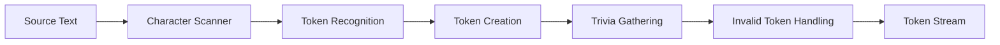

# RFC-20250115: DBML Lexer Implementation

**Status**: IMPLEMENTED
**Last Updated**: 2025-01-15

## TLDR

The DBML lexer is the first stage of the modern parsing pipeline that converts raw DBML source text into a stream of typed tokens. It implements a hand-written scanner with precise position tracking, comprehensive error handling, and sophisticated trivia management for whitespace and comments.

## Concepts

- **Token**: Atomic lexical unit with kind, value, and position information
- **Trivia**: Non-semantic tokens (whitespace, comments) attached to meaningful tokens
- **Invalid Tokens**: Malformed tokens that generate errors but allow continued parsing
- **Position Tracking**: Precise line, column, and offset information for each character
- **Lookahead**: Ability to inspect upcoming characters without consuming them
- **Escape Sequences**: Special character representations in string literals

## High-level Architecture

The lexer implements a state-machine approach with character-by-character scanning:



**Design Decisions:**

1. **Hand-Written Scanner**: Provides precise control over tokenization and error handling
2. **Position Tracking**: Maintains exact source locations for IDE features and error reporting  
3. **Trivia Attachment**: Associates whitespace and comments with adjacent meaningful tokens
4. **Error Recovery**: Continues tokenization after errors to find multiple issues
5. **Lookahead Support**: Enables complex token recognition patterns

## Pipeline Architecture Deep Dive

Understanding how the lexer transforms raw text into structured tokens:

### Character Scanning
**Purpose**: Convert raw text into positioned character stream.

**Key Features**:
- Tracks precise position (line, column, offset)
- Handles encoding and line endings
- Provides lookahead capability

### Token Recognition
**Purpose**: Group characters into meaningful lexical units.

**Key Features**:
- Pattern matching for identifiers, numbers, strings
- Multi-character operator recognition (`<=`, `>=`, `<>`)
- Context-aware string literal handling

```javascript
// "Table users {" → ['Table', ' ', 'users', ' ', '{']
```

### Token Creation
**Purpose**: Transform text fragments into structured token objects.

**Key Features**:
- Rich metadata (type, position, value)
- Precise source location tracking
- Error state management

```javascript
{
  kind: 'IDENTIFIER',
  value: 'Table',
  startPos: { line: 0, column: 0, offset: 0 },
  endPos: { line: 0, column: 5, offset: 5 }
}
```

### Trivia Attachment
**Purpose**: Preserve formatting information for IDE features.

**Key Features**:
- Associates whitespace and comments with meaningful tokens
- Maintains original code formatting
- Enables format-preserving transformations

```javascript
// [Table] [space] [space] [users] → [Table{trailingTrivia: [space, space]}] [users]
```

### Error Recovery
**Purpose**: Handle malformed tokens without stopping processing.

**Key Features**:
- Continues after encountering invalid tokens
- Reports multiple errors in single pass
- Maintains context for better error messages

```javascript
// "Table users { id @#$%invalid }" → continues past @#$% to find more errors
```

### Final Token Stream
**Purpose**: Provide clean, organized token sequence for the parser.

**Key Features**:
- Well-formed token sequence with EOF marker
- Metadata preserved but organized
- Clean interface for syntax analysis

## Detailed Implementation

### Core Lexer Class

**Location**: `packages/dbml-parse/src/lib/lexer/lexer.ts`

```typescript
export default class Lexer {
  private start: Position;     // Start of current token
  private current: Position;   // Current scanning position
  private text: string;        // Source text
  private tokens: SyntaxToken[]; // Valid tokens
  private errors: CompileError[]; // Lexical errors
}
```

### Token Types

**Location**: `packages/dbml-parse/src/lib/lexer/tokens.ts`

The lexer recognizes 25 distinct token types:

#### Structural Tokens
- **Delimiters**: `(`, `)`, `{`, `}`, `[`, `]`
- **Separators**: `,`, `;`, `:`
- **Special**: `~` (tilde for partial injection)

#### Literal Tokens
- **NUMERIC_LITERAL**: Numbers with optional decimal points (`123`, `45.67`)
- **STRING_LITERAL**: Single-quoted strings with escape sequence support
- **COLOR_LITERAL**: Hex color values (`#FF0000`)
- **FUNCTION_EXPRESSION**: Backtick-delimited expressions (`` `now()` ``)
- **QUOTED_STRING**: Double-quoted identifiers

#### Identifier and Operator Tokens
- **IDENTIFIER**: Alphanumeric identifiers (`table_name`, `user_id`)
- **OP**: Operators and relationship symbols (`<`, `>`, `<=`, `>=`, `=`, `!=`, `<>`, `-`, etc.)

#### Trivia Tokens
- **SPACE**, **TAB**, **NEWLINE**: Whitespace
- **SINGLE_LINE_COMMENT**: `// comment`
- **MULTILINE_COMMENT**: `/* comment */`

#### Control Token
- **EOF**: End of file marker

### Tokenization Example

To understand how the lexer works, let's trace through a complete DBML example:

```dbml
Table schema1.users {
  id int [pk, increment] // Primary key
  name varchar(255) [not null]
  email text [unique, note: 'User email address']
  status user_status [default: 'active']
  created_at timestamp [default: `now()`]

  Indexes {
    (name, email) [name: "user_lookup"]
  }
}

Table posts {
  id int [pk, increment]
  title varchar(500) [not null]
  content text
  user_id int [not null, note: 'Foreign key to users table']
  created_at timestamp [default: `now()`]
}

Enum user_status {
  active
  inactive [note: 'Disabled users']
}

Ref: schema1.users.id < posts.user_id
```

**Token Stream Output (Partial - showing key patterns):**

```javascript
[
  // Table declaration
  { kind: 'IDENTIFIER', value: 'Table', startPos: {line: 0, column: 0} },
  { kind: 'SPACE', value: ' ' },
  { kind: 'IDENTIFIER', value: 'schema1' },
  { kind: 'OP', value: '.' },  // Note: dot is an operator
  { kind: 'IDENTIFIER', value: 'users' },
  { kind: 'SPACE', value: ' ' },
  { kind: 'LBRACE', value: '{' },
  { kind: 'NEWLINE', value: '\n' },

  // Field: id int [pk, increment]
  { kind: 'SPACE', value: '  ' },  // Leading indentation
  { kind: 'IDENTIFIER', value: 'id' },
  { kind: 'SPACE', value: ' ' },
  { kind: 'IDENTIFIER', value: 'int' },
  { kind: 'SPACE', value: ' ' },
  { kind: 'LBRACKET', value: '[' },
  { kind: 'IDENTIFIER', value: 'pk' },
  { kind: 'COMMA', value: ',' },
  { kind: 'SPACE', value: ' ' },
  { kind: 'IDENTIFIER', value: 'increment' },
  { kind: 'RBRACKET', value: ']' },
  { kind: 'SPACE', value: ' ' },
  { kind: 'SINGLE_LINE_COMMENT', value: '// Primary key' },
  { kind: 'NEWLINE', value: '\n' },

  // Field: name varchar(255) [not null]
  { kind: 'SPACE', value: '  ' },
  { kind: 'IDENTIFIER', value: 'name' },
  { kind: 'SPACE', value: ' ' },
  { kind: 'IDENTIFIER', value: 'varchar' },
  { kind: 'LPAREN', value: '(' },
  { kind: 'NUMERIC_LITERAL', value: '255' },
  { kind: 'RPAREN', value: ')' },
  { kind: 'SPACE', value: ' ' },
  { kind: 'LBRACKET', value: '[' },
  { kind: 'IDENTIFIER', value: 'not' },
  { kind: 'SPACE', value: ' ' },
  { kind: 'IDENTIFIER', value: 'null' },
  { kind: 'RBRACKET', value: ']' },
  { kind: 'NEWLINE', value: '\n' },

  // Field with note: email text [unique, note: 'User email address']
  { kind: 'SPACE', value: '  ' },
  { kind: 'IDENTIFIER', value: 'email' },
  { kind: 'SPACE', value: ' ' },
  { kind: 'IDENTIFIER', value: 'text' },
  { kind: 'SPACE', value: ' ' },
  { kind: 'LBRACKET', value: '[' },
  { kind: 'IDENTIFIER', value: 'unique' },
  { kind: 'COMMA', value: ',' },
  { kind: 'SPACE', value: ' ' },
  { kind: 'IDENTIFIER', value: 'note' },
  { kind: 'COLON', value: ':' },
  { kind: 'SPACE', value: ' ' },
  { kind: 'STRING_LITERAL', value: 'User email address' },  // Single quotes consumed
  { kind: 'RBRACKET', value: ']' },
  { kind: 'NEWLINE', value: '\n' },

  // Field with function expression: created_at timestamp [default: `now()`]
  { kind: 'SPACE', value: '  ' },
  { kind: 'IDENTIFIER', value: 'created_at' },
  { kind: 'SPACE', value: ' ' },
  { kind: 'IDENTIFIER', value: 'timestamp' },
  { kind: 'SPACE', value: ' ' },
  { kind: 'LBRACKET', value: '[' },
  { kind: 'IDENTIFIER', value: 'default' },
  { kind: 'COLON', value: ':' },
  { kind: 'SPACE', value: ' ' },
  { kind: 'FUNCTION_EXPRESSION', value: 'now()' },  // Backticks consumed
  { kind: 'RBRACKET', value: ']' },
  { kind: 'NEWLINE', value: '\n' },

    // ... more tokens for Indexes block, posts table definition, Enum, and Ref

  // Relationship: Ref: schema1.users.id < posts.user_id
  { kind: 'IDENTIFIER', value: 'Ref' },
  { kind: 'COLON', value: ':' },
  { kind: 'SPACE', value: ' ' },
  { kind: 'IDENTIFIER', value: 'schema1' },
  { kind: 'OP', value: '.' },
  { kind: 'IDENTIFIER', value: 'users' },
  { kind: 'OP', value: '.' },
  { kind: 'IDENTIFIER', value: 'id' },
  { kind: 'SPACE', value: ' ' },
  { kind: 'OP', value: '<' },  // Relationship operator (not delimiter!)
  { kind: 'SPACE', value: ' ' },
  { kind: 'IDENTIFIER', value: 'posts' },
  { kind: 'OP', value: '.' },
  { kind: 'IDENTIFIER', value: 'user_id' },
  { kind: 'EOF', value: '' }
]
```

**Key Observations:**

1. **Position Tracking**: Each token includes precise start/end positions for IDE features
2. **Trivia Preservation**: Whitespace and comments are captured but attached to meaningful tokens
3. **Context-Independent**: The lexer doesn't distinguish between `.` as schema separator vs. table.field reference
4. **String Processing**: Quote characters are consumed, only content is preserved
5. **Relationship Operators**: `<`, `>` are always tokenized as `OP`, never as delimiters

### Tokenization Process

#### 1. Main Scanning Loop

```typescript
scanTokens() {
  while (!this.isAtEnd()) {
    const c = this.advance();
    switch (c) {
      case ' ': this.addToken(SyntaxTokenKind.SPACE); break;
      case '\n': this.addToken(SyntaxTokenKind.NEWLINE); break;
      case '\t': this.addToken(SyntaxTokenKind.TAB); break;
      case '(': this.addToken(SyntaxTokenKind.LPAREN); break;
      // ... more cases
      case "'":
        if (this.match("''")) {
          this.multilineStringLiteral();
        } else {
          this.singleLineStringLiteral();
        }
        break;
      default:
        if (isOp(c)) this.operator(c);
        else if (isAlphaOrUnderscore(c)) this.identifier();
        else if (isDigit(c)) this.numericLiteralOrIdentifier();
        else this.handleUnknownCharacter(c);
    }
    this.start = { ...this.current };
  }
}
```

#### 2. Complex Token Recognition

**String Literals with Escape Sequences:**
```typescript
escapedString(): string {
  switch (this.advance()) {
    case 't': return '\t';
    case 'n': return '\n';
    case '\\': return '\\';
    case 'u': {
      let hex = '';
      for (let i = 0; i <= 3; i += 1) {
        hex += this.advance();
      }
      return String.fromCharCode(parseInt(hex, 16));
    }
    // ... more escape sequences
  }
}
```

**Numeric vs Identifier Disambiguation:**
```typescript
numericLiteralOrIdentifier() {
  let nDots = 0;
  while (!this.isAtEnd()) {
    const isDot = this.check('.');
    nDots += isDot ? 1 : 0;

    if (nDots > 1) break; // Invalid number

    if (!isDot && !isAlphaNumeric(this.peek()!)) {
      return this.addToken(SyntaxTokenKind.NUMERIC_LITERAL);
    }

    if (!isDot && !isDigit(this.peek()!)) {
      // Contains letters - must be identifier
      break;
    }

    this.advance();
  }
  // Handle invalid numbers or identifiers
}
```

### Position Tracking System

**Position Structure:**
```typescript
interface Position {
  offset: number;  // Character offset from start
  line: number;    // Zero-based line number
  column: number;  // Zero-based column number
}
```

**Precise Position Updates:**
```typescript
private advance(): string {
  const c = this.peek();
  this.current = { ...this.current };
  if (c === '\n') {
    this.current.line += 1;
    this.current.column = 0;
  } else {
    this.current.column += 1;
  }
  this.current.offset += 1;
  return c!;
}
```

### Token Structure

**Comprehensive Token Information:**
```typescript
class SyntaxToken {
  kind: SyntaxTokenKind;           // Token type
  value: string;                   // Raw text value
  startPos: Position;              // Start position
  endPos: Position;                // End position
  isInvalid: boolean;              // Error flag

  // Trivia attachments
  leadingTrivia: SyntaxToken[];    // Preceding whitespace/comments
  trailingTrivia: SyntaxToken[];   // Following whitespace/comments

  // Invalid token attachments
  leadingInvalid: SyntaxToken[];   // Preceding invalid tokens
  trailingInvalid: SyntaxToken[];  // Following invalid tokens
}
```

### Trivia Management

The lexer implements sophisticated trivia handling to preserve formatting information:

#### 1. Trivia Classification
```typescript
function isTriviaToken(token: SyntaxToken): boolean {
  switch (token.kind) {
    case SyntaxTokenKind.NEWLINE:
    case SyntaxTokenKind.SPACE:
    case SyntaxTokenKind.TAB:
    case SyntaxTokenKind.SINGLE_LINE_COMMENT:
    case SyntaxTokenKind.MULTILINE_COMMENT:
      return true;
    default:
      return false;
  }
}
```

#### 2. Trivia Attachment Logic
```typescript
gatherTrivia() {
  let startOfLine = true;
  let triviaList: SyntaxToken[] = [];
  let lastNonTrivia: SyntaxToken | undefined;

  for (const token of this.tokens) {
    if (isTriviaToken(token)) {
      triviaList.push(token);
      if (token.kind === SyntaxTokenKind.NEWLINE && lastNonTrivia) {
        lastNonTrivia.trailingTrivia = triviaList;
        startOfLine = true;
        lastNonTrivia = undefined;
        triviaList = [];
      }
    } else {
      // Attach trivia to meaningful tokens
      if (startOfLine) {
        token.leadingTrivia = triviaList;
      } else {
        lastNonTrivia!.trailingTrivia = triviaList;
      }
      triviaList = [];
      lastNonTrivia = token;
      startOfLine = false;
    }
  }
}
```

### Error Handling and Recovery

#### 1. Structured Error Reporting
```typescript
// Unknown character handling
this.addToken(SyntaxTokenKind.OP, true); // Mark as invalid
this.errors.push(
  new CompileError(
    CompileErrorCode.UNKNOWN_SYMBOL,
    `Unexpected token '${c}'`,
    this.createToken(SyntaxTokenKind.OP, true)
  )
);
```

#### 2. Invalid Token Management
```typescript
gatherInvalid() {
  const newTokenList: SyntaxToken[] = [];

  // Collect leading invalid tokens
  let i;
  const leadingInvalidList: SyntaxToken[] = [];
  for (i = 0; i < this.tokens.length && isInvalidToken(this.tokens[i]); i += 1) {
    leadingInvalidList.push(this.tokens[i]);
  }

  // Attach invalid tokens to valid ones
  let prevValidToken = this.tokens[i];
  prevValidToken.leadingInvalid = [...leadingInvalidList, ...prevValidToken.leadingInvalid];

  for (; i < this.tokens.length; i += 1) {
    const token = this.tokens[i];
    if (token.isInvalid) {
      prevValidToken.trailingInvalid.push(token);
    } else {
      prevValidToken = token;
      newTokenList.push(token);
    }
  }

  this.tokens = newTokenList;
}
```

### String Processing

#### 1. Single-line String Literals
```typescript
singleLineStringLiteral() {
  this.consumeUntil(SyntaxTokenKind.STRING_LITERAL, "'", {
    allowNewline: false,
    allowEof: false,
    raw: false,
  });
}
```

#### 2. Multi-line String Literals
```typescript
multilineStringLiteral() {
  this.consumeUntil(SyntaxTokenKind.STRING_LITERAL, "'''", {
    allowNewline: true,
    allowEof: false,
    raw: false,
  });
}
```

#### 3. Generic Consumption Pattern
```typescript
consumeUntil(
  tokenKind: SyntaxTokenKind,
  stopSequence: string,
  options: {
    allowNewline: boolean;
    allowEof: boolean;
    raw: boolean;
    consumeStopSequence?: boolean;
  }
) {
  let string = '';

  while (!this.isAtEnd() &&
         (options.allowNewline || !this.check('\n')) &&
         !this.check(stopSequence)) {
    if (this.peek() === '\\' && !options.raw) {
      this.advance();
      string += this.escapedString();
    } else {
      string += this.advance();
    }
  }

  // Handle end conditions and create token
}
```

### Comment Processing

#### 1. Single-line Comments
```typescript
singleLineComment() {
  while (!this.isAtEnd() && this.peek() !== '\n') {
    this.advance();
  }
  this.addToken(SyntaxTokenKind.SINGLE_LINE_COMMENT);
}
```

#### 2. Multi-line Comments
```typescript
multilineComment() {
  while (!this.isAtEnd() && !this.check('*/')) {
    this.advance();
  }

  if (this.isAtEnd()) {
    // Error: Unterminated comment
    this.addToken(SyntaxTokenKind.MULTILINE_COMMENT, true);
    this.errors.push(/* error */);
  } else {
    this.match('*/');
    this.addToken(SyntaxTokenKind.MULTILINE_COMMENT);
  }
}
```

### Performance Characteristics

**Time Complexity**: O(n) where n is source length - single pass through input
**Space Complexity**: O(n) for token storage and position tracking
**Error Recovery**: Continues after errors to find all lexical issues
**Memory Efficiency**: Tokens store references to source positions rather than duplicating text

### Integration with Parser

**Token Stream Interface:**
```typescript
lex(): Report<SyntaxToken[], CompileError> {
  this.scanTokens();
  this.tokens.push(SyntaxToken.create(SyntaxTokenKind.EOF, this.start, this.current, '', false));
  this.gatherTrivia();
  this.gatherInvalid();

  return new Report(this.tokens, this.errors);
}
```

**Parser Consumption:**
```typescript
// Parser uses token stream
const lexResult = new Lexer(source).lex();
const parser = new Parser(lexResult.getValue(), nodeIdGenerator);
const parseResult = parser.parse();
```

### Testing Strategy

**Token Recognition Tests**: Verify correct categorization of all token types
**Position Tracking Tests**: Validate accurate line/column/offset calculation
**Error Handling Tests**: Ensure proper error reporting for invalid input
**Trivia Tests**: Confirm correct whitespace and comment attachment
**Escape Sequence Tests**: Validate string literal processing

**Example Test Pattern:**
```typescript
describe('Lexer', () => {
  it('should tokenize basic table definition', () => {
    const input = 'Table users { id int [pk] }';
    const tokens = new Lexer(input).lex().getValue();

    expect(tokens).toEqual([
      expect.objectContaining({ kind: 'IDENTIFIER', value: 'Table' }),
      expect.objectContaining({ kind: 'IDENTIFIER', value: 'users' }),
      expect.objectContaining({ kind: 'LBRACE', value: '{' }),
      // ... more assertions
    ]);
  });
});
```

## Limitations and Known Issues

### 1. Inconsistent Angle Bracket Handling

**Issue**: The lexer defines `LANGLE` and `RANGLE` token types but never produces them.

**Details**:
- Token definitions include `LANGLE = '<langle>'` and `RANGLE = '<rangle>'`
- In practice, `<` and `>` are always tokenized as `OP` tokens through the `isOp()` function
- This creates dead code and misleading documentation

**Impact**:
- Confusing for developers reading the token definitions
- Dead code that should be removed
- Documentation incorrectly lists them as delimiters

**Current Workaround**: Parser handles `<` and `>` as operators, which works correctly for DBML's relationship syntax

**Recommended Fix**: Remove unused `LANGLE` and `RANGLE` token types from the enum

### 2. Context-Independent Tokenization

**Issue**: The lexer cannot distinguish between different uses of the same character.

**Examples**:
- `.` used as schema separator (`schema1.table1`) vs. decimal point (`3.14`)
- `<` and `>` used in relationships vs. potential future generic type syntax

**Impact**:
- Parser must handle disambiguation, increasing complexity
- Some language features may be harder to implement

**Current Approach**: Parser performs context-sensitive interpretation of operator tokens

### 3. Limited Unicode Support

**Issue**: The lexer primarily handles ASCII characters with basic Unicode escape sequences.

**Details**:
- Unicode identifiers are not fully supported
- Only `\uHHHH` escape sequences are implemented
- No support for Unicode categories or normalization

**Impact**:
- Limited internationalization support
- Cannot handle non-ASCII table/column names from some databases

### 4. No Streaming Support

**Issue**: The lexer requires the entire source text in memory.

**Impact**:
- Cannot handle extremely large DBML files efficiently
- Not suitable for streaming or incremental parsing scenarios

### 5. Rigid Comment Attachment

**Issue**: Trivia attachment rules are fixed and may not match all formatting preferences.

**Details**:
- Comments are attached to the next non-trivia token
- No way to customize trivia attachment behavior
- May not preserve intended comment associations in all cases

## Design Evolution

**Original Design**: Integrated with PEG.js parser - no separate lexical analysis
**Current Design**: Standalone lexer with comprehensive token model and trivia support
**Future Direction**: Enhanced Unicode support and streaming lexical analysis

**Key Improvements**:
- Precise position tracking for IDE integration
- Sophisticated trivia management preserving formatting
- Robust error recovery enabling multiple error reporting
- Extensible token system supporting language evolution

**Lessons Learned**:
- Position tracking is crucial for IDE features and error reporting
- Trivia attachment enables format-preserving transformations
- Error recovery at lexical level improves overall parsing robustness
- Hand-written lexers provide better control than generated alternatives

## Related RFCs
- [RFC-20250115: DBML to JSON Database Model Parser](rfc-20250115-dbml-to-json-parser.md)