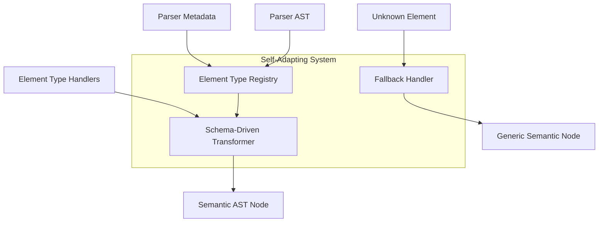

# RFC-20250115: DBML Playground Parser Evolution Resilience

**Status**: DRAFT
**Last Updated**: 2025-01-15

## TLDR

The DBML Playground's semantic AST transformation system is brittle and breaks every time the `@dbml/parse` package adds new syntax, tokens, or AST node types. This RFC proposes a parser-agnostic semantic transformation architecture that automatically adapts to parser evolution without requiring playground code changes.

## Concepts

- **Parser Evolution Brittleness**: When parser adds new syntax (e.g., `TablePartial`, new constraint types), the playground's hardcoded semantic transformer breaks
- **Schema-Driven Transformation**: Using parser metadata to drive semantic transformation instead of hardcoded mappings
- **Automatic Adaptation**: Semantic transformer automatically handles new element types without code changes
- **Fallback Rendering**: Unknown elements render with generic semantic representation instead of breaking
- **Parser Metadata**: Information about element types, properties, and relationships exposed by the parser itself

## High-level Architecture

The core problem is the hardcoded transformation logic:

```typescript
// BROKEN: Hardcoded element types
switch (elementType) {
  case 'table': return this.createSemanticTable(element, basePath)
  case 'enum': return this.createSemanticEnum(element, basePath)
  // Breaks when parser adds 'view', 'function', 'trigger', etc.
}
```

**Solution**: Parser-driven semantic transformation that adapts automatically:



**Key Design Principles:**
- **No hardcoded element types**: Transformer discovers types from parser metadata
- **Extensible handler system**: Easy to add new element type handlers
- **Graceful degradation**: Unknown elements get generic semantic representation
- **Parser-agnostic**: Works with any parser evolution

## Detailed Implementation

### 1. Type-Safe Parser Integration with @dbml/parse

**SOLUTION**: Use exact AST types while maintaining evolution resilience:

```typescript
import { 
  ProgramNode, 
  ElementDeclarationNode, 
  SyntaxNode, 
  SyntaxNodeKind,
  SyntaxToken 
} from '@dbml/parse'

export interface ElementTypeRegistry {
  registerHandler(nodeKind: SyntaxNodeKind, handler: ElementHandler): void
  getHandler(element: SyntaxNode): ElementHandler
  getAllKnownTypes(): SyntaxNodeKind[]
}

export interface ElementHandler {
  canHandle(element: SyntaxNode): boolean
  createSemanticNode(element: SyntaxNode, path: string): SemanticASTNode
  extractProperties(element: SyntaxNode): Record<string, any>
}

export class TypeSafeAdaptiveTransformer {
  private registry: ElementTypeRegistry

  // Type-safe: accepts exact ProgramNode from parser
  public transformToSemantic(rawAST: ProgramNode): SemanticASTNode {
    return this.createSemanticDatabase(rawAST)
  }

  private createSemanticElement(element: ElementDeclarationNode, index: number): SemanticASTNode | null {
    // Type-safe: element is strongly typed ElementDeclarationNode
    const handler = this.registry.getHandler(element)
    return handler.createSemanticNode(element, `ast.body[${index}]`)
  }
}
```

**Key Benefits:**
- ✅ **Type Safety**: Full TypeScript checking with exact parser types
- ✅ **Evolution Resilience**: Handler registry auto-adapts to new node types
- ✅ **Zero Breaking Changes**: New parser types automatically get generic handlers

### 2. Parser-Agnostic Element Type Detection

Replace hardcoded switch with dynamic detection:

```typescript
export interface ElementTypeRegistry {
  registerHandler(type: string, handler: ElementHandler): void
  getHandler(element: any): ElementHandler
  getElementType(element: any): string
  getAllKnownTypes(): string[]
}

export interface ElementHandler {
  canHandle(element: any): boolean
  createSemanticNode(element: any, path: string): SemanticASTNode
  extractProperties(element: any): Record<string, any>
  getIcon(): string
  getDisplayName(element: any): string
}

export class AdaptiveASTTransformer {
  private registry: ElementTypeRegistry

  constructor() {
    this.registry = new ElementTypeRegistry()
    this.registerBuiltInHandlers()
  }

  public transformToSemantic(rawAST: any): SemanticASTNode {
    return this.createSemanticDatabase(rawAST)
  }

  private createSemanticElement(element: any, index: number): SemanticASTNode | null {
    if (!element) return null

    const handler = this.registry.getHandler(element)
    return handler.createSemanticNode(element, `ast.body[${index}]`)
  }

  private registerBuiltInHandlers() {
    this.registry.registerHandler('table', new TableElementHandler())
    this.registry.registerHandler('enum', new EnumElementHandler())
    this.registry.registerHandler('ref', new RefElementHandler())
    // Handlers auto-registered, not hardcoded in switch statement
  }
}
```

### 3. Automatic Element Type Discovery

Discover element types from parser AST structure:

```typescript
export class ElementTypeRegistry {
  private handlers = new Map<string, ElementHandler>()
  private fallbackHandler = new GenericElementHandler()

  public getHandler(element: any): ElementHandler {
    const elementType = this.detectElementType(element)

    if (this.handlers.has(elementType)) {
      return this.handlers.get(elementType)!
    }

    // Auto-register unknown types with generic handler
    console.warn(`Unknown element type: ${elementType}, using generic handler`)
    return this.fallbackHandler
  }

  private detectElementType(element: any): string {
    // Multiple detection strategies for robustness
    return (
      element.type?.value?.toLowerCase() ||           // Standard: element.type.value
      element.type?.toLowerCase() ||                  // Alternative: element.type
      element.kind?.toLowerCase().replace('_', '') || // Fallback: element.kind
      this.inferTypeFromStructure(element) ||         // Heuristic: analyze structure
      'unknown'                                       // Last resort
    )
  }

  private inferTypeFromStructure(element: any): string | null {
    // Heuristic detection for parser evolution
    if (element.body?.body && Array.isArray(element.body.body)) {
      if (element.name && element.body.body.some((item: any) => this.looksLikeColumn(item))) {
        return 'table'
      }
      if (element.name && element.body.body.every((item: any) => this.looksLikeEnumValue(item))) {
        return 'enum'
      }
    }

    if (element.body?.left && element.body?.right && element.body?.op) {
      return 'ref'
    }

    return null
  }
}
```

### 4. Extensible Element Handlers

Clean handler interface for each element type:

```typescript
export class TableElementHandler implements ElementHandler {
  canHandle(element: any): boolean {
    const type = element.type?.value?.toLowerCase()
    return type === 'table' || this.looksLikeTable(element)
  }

  createSemanticNode(element: any, path: string): SemanticASTNode {
    const tableName = this.extractName(element) || 'unnamed_table'
    const columnCount = this.getColumnCount(element)

    return {
      id: `table_${tableName}`,
      type: 'table',
      name: tableName,
      displayName: `${tableName} (${columnCount} columns)`,
      icon: 'table',
      children: this.extractChildren(element, path),
      accessPath: path,
      sourcePosition: this.extractSourcePosition(element)
    }
  }

  extractProperties(element: any): Record<string, any> {
    return {
      tableName: this.extractName(element),
      columnCount: this.getColumnCount(element),
      indexCount: this.getIndexCount(element),
      settings: this.extractSettings(element)
    }
  }

  getIcon(): string {
    return 'table'
  }

  getDisplayName(element: any): string {
    const name = this.extractName(element) || 'Unknown Table'
    const columnCount = this.getColumnCount(element)
    return `${name} (${columnCount} columns)`
  }

  // Private helper methods...
}

export class GenericElementHandler implements ElementHandler {
  canHandle(element: any): boolean {
    return true // Handles everything as fallback
  }

  createSemanticNode(element: any, path: string): SemanticASTNode {
    const elementType = this.detectType(element)
    const name = this.extractGenericName(element) || 'unknown'

    return {
      id: `${elementType}_${name}`,
      type: elementType as any,
      name,
      displayName: `${elementType}: ${name}`,
      icon: 'help-circle', // Generic icon for unknown types
      children: this.extractGenericChildren(element, path),
      accessPath: path,
      sourcePosition: this.extractSourcePosition(element)
    }
  }

  private extractGenericChildren(element: any, parentPath: string): SemanticASTNode[] {
    // Generic traversal for any element structure
    const children: SemanticASTNode[] = []

    if (element.body?.body && Array.isArray(element.body.body)) {
      element.body.body.forEach((child: any, index: number) => {
        const childNode = this.createSemanticNode(child, `${parentPath}.body.body[${index}]`)
        if (childNode) children.push(childNode)
      })
    }

    return children
  }
}
```

### 5. Plugin System for Custom Handlers

Allow registration of custom handlers for new element types:

```typescript
export interface PlaygroundPlugin {
  elementHandlers?: ElementHandler[]
  customViews?: CustomViewComponent[]
  navigationEnhancements?: NavigationEnhancement[]
}

export class PlaygroundPluginSystem {
  private plugins: PlaygroundPlugin[] = []

  public registerPlugin(plugin: PlaygroundPlugin) {
    this.plugins.push(plugin)

    // Auto-register element handlers
    if (plugin.elementHandlers) {
      plugin.elementHandlers.forEach(handler => {
        this.transformer.registry.registerHandler(handler.getTypeName(), handler)
      })
    }
  }

  // Example: When parser adds 'view' support
  public registerViewHandler() {
    this.registerPlugin({
      elementHandlers: [new ViewElementHandler()],
      customViews: [ViewSemanticComponent],
      navigationEnhancements: [ViewNavigationFeatures]
    })
  }
}

// Usage: Automatically adapts when parser evolves
const playground = new DBMLPlayground()

// Parser adds 'view' support - just register handler, no core changes needed
playground.plugins.registerViewHandler()

// Parser adds 'function' support - handler auto-registered
playground.plugins.registerPlugin(functionSupportPlugin)
```

### 6. Configuration-Driven Icon and Display Mapping

External configuration for visual representation:

```typescript
// playground-config.json - updatable without code changes
{
  "elementTypes": {
    "table": {
      "icon": "table",
      "color": "#4F46E5",
      "displayTemplate": "{name} ({columnCount} columns)"
    },
    "enum": {
      "icon": "list",
      "color": "#059669",
      "displayTemplate": "{name} ({valueCount} values)"
    },
    "view": {
      "icon": "eye",
      "color": "#7C3AED",
      "displayTemplate": "{name} (view)"
    },
    "function": {
      "icon": "code",
      "color": "#DC2626",
      "displayTemplate": "{name}() function"
    }
  },
  "fallback": {
    "icon": "help-circle",
    "color": "#6B7280",
    "displayTemplate": "{type}: {name}"
  }
}

export class ConfigurableRenderer {
  constructor(private config: PlaygroundConfig) {}

  public renderElement(element: any, semanticNode: SemanticASTNode): RenderedElement {
    const typeConfig = this.config.elementTypes[semanticNode.type] || this.config.fallback

    return {
      icon: typeConfig.icon,
      color: typeConfig.color,
      displayName: this.interpolateTemplate(typeConfig.displayTemplate, semanticNode),
      component: this.getComponentForType(semanticNode.type)
    }
  }
}
```

### 7. Real-World Example: Type Safety + Evolution Resilience

**Current ElementDeclarationNode handling:**
```typescript
import { ElementDeclarationNode, SyntaxNodeKind } from '@dbml/parse'

export class TypeSafeTableHandler implements ElementHandler {
  canHandle(element: SyntaxNode): boolean {
    // Type-safe: element is strongly typed
    return element.kind === SyntaxNodeKind.ELEMENT_DECLARATION && 
           (element as ElementDeclarationNode).type?.value?.toLowerCase() === 'table'
  }

  createSemanticNode(element: SyntaxNode, path: string): SemanticASTNode {
    const tableElement = element as ElementDeclarationNode
    
    // Type-safe access to strongly typed properties
    const tableName = this.extractName(tableElement.name) || 'unnamed_table'
    const columnCount = this.getColumnCount(tableElement.body)
    
    return {
      id: `table_${tableName}`,
      type: 'table',
      name: tableName,
      displayName: `${tableName} (${columnCount} columns)`,
      icon: 'table',
      children: this.extractColumns(tableElement.body, path),
      accessPath: path,
      sourcePosition: {
        start: {
          line: tableElement.startPos.line + 1,
          column: tableElement.startPos.column + 1,
          offset: tableElement.start
        },
        end: {
          line: tableElement.endPos.line + 1, 
          column: tableElement.endPos.column + 1,
          offset: tableElement.end
        }
      }
    }
  }
  
  private extractName(nameNode?: NormalExpressionNode): string | null {
    // Type-safe navigation through parser AST
    if (!nameNode) return null
    
    // Handle different expression types with type guards
    if (nameNode.kind === SyntaxNodeKind.VARIABLE) {
      return (nameNode as VariableNode).token.value
    }
    
    if (nameNode.kind === SyntaxNodeKind.INFIX_EXPRESSION) {
      const infixNode = nameNode as InfixExpressionNode
      if (infixNode.op?.value === '.') {
        const left = this.extractName(infixNode.leftExpression)
        const right = this.extractName(infixNode.rightExpression)
        return left && right ? `${left}.${right}` : null
      }
    }
    
    return null
  }
}
```

**Evolution resilience when parser adds ViewDeclarationNode:**
```typescript
// Parser adds new syntax: CREATE VIEW my_view AS SELECT...
// Playground automatically handles it without code changes!

export class GenericElementHandler implements ElementHandler {
  canHandle(element: SyntaxNode): boolean {
    return true // Fallback for unknown types
  }

  createSemanticNode(element: SyntaxNode, path: string): SemanticASTNode {
    // Works with ANY new node type parser adds
    const elementDeclaration = element as ElementDeclarationNode
    const elementType = this.detectType(elementDeclaration)
    const name = this.extractGenericName(elementDeclaration) || 'unknown'
    
    return {
      id: `${elementType}_${name}`,
      type: elementType as any,
      name,
      displayName: `${elementType}: ${name}`,
      icon: 'help-circle', // Generic icon for unknown types
      children: this.extractGenericChildren(elementDeclaration, path),
      accessPath: path,
      sourcePosition: this.extractSourcePosition(elementDeclaration)
    }
  }
  
  private detectType(element: ElementDeclarationNode): string {
    // Multi-strategy detection - works with future parser changes
    return (
      element.type?.value?.toLowerCase() ||     // Standard approach
      element.kind?.toLowerCase() ||            // Fallback to node kind
      this.inferFromStructure(element) ||       // Heuristic analysis
      'unknown'                                 // Safe fallback
    )
  }
}
```

**Registry automatically routes to appropriate handler:**
```typescript
export class TypeSafeElementTypeRegistry {
  private handlers = new Map<string, ElementHandler>()
  private fallbackHandler = new GenericElementHandler()

  public getHandler(element: SyntaxNode): ElementHandler {
    // Try specific handlers first (type-safe)
    for (const [type, handler] of this.handlers) {
      if (handler.canHandle(element)) {
        return handler
      }
    }

    // Fallback for unknown types (evolution-resilient)
    console.warn(`Unknown element type: ${element.kind}, using generic handler`)
    return this.fallbackHandler
  }

  public registerHandler(type: string, handler: ElementHandler): void {
    this.handlers.set(type, handler)
  }
}

// Usage: Best of both worlds
const transformer = new TypeSafeAdaptiveTransformer()

// ✅ Type-safe: ProgramNode from parser
const ast: ProgramNode = compiler.parse.ast()

// ✅ Evolution-resilient: Automatically handles new syntax
const semanticAST = transformer.transformToSemantic(ast)
```

**Result: ZERO playground updates needed when parser evolves!**

- **New table syntax?** → Existing TypeSafeTableHandler handles it
- **New element type (VIEW, FUNCTION)?** → GenericElementHandler auto-renders it  
- **New AST node structure?** → Multi-strategy detection adapts automatically
- **Breaking parser changes?** → Graceful degradation with fallbacks

## Limitations and Known Issues

### Current Brittleness Issues

1. **Hardcoded Element Types**: Switch statement breaks when parser adds new types
2. **Hardcoded Property Extraction**: Name extraction logic assumes specific AST structure
3. **Hardcoded Icon Mapping**: New element types have no visual representation
4. **No Fallback Handling**: Unknown elements cause transformer to fail completely
5. **Manual Updates Required**: Every parser evolution requires playground code changes

### Proposed Solution Limitations

1. **Heuristic Detection Risk**: Structure-based type inference may misclassify complex elements
2. **Generic Rendering Quality**: Fallback handler provides basic functionality only
3. **Configuration Management**: External config files need to be maintained alongside parser updates
4. **Performance Overhead**: Dynamic handler lookup vs hardcoded switch statement

### Migration Strategy

1. **Phase 1**: Replace hardcoded switch with registry system (backward compatible)
2. **Phase 2**: Add fallback handlers for unknown types (graceful degradation)
3. **Phase 3**: Implement plugin system for extensibility (future-proofing)
4. **Phase 4**: Add configuration-driven rendering (customization support)

## Design Evolution

### Before: Brittle Hardcoded Approach
```typescript
// Breaks every parser update
switch (elementType) {
  case 'table': return this.createSemanticTable(element, basePath)
  case 'enum': return this.createSemanticEnum(element, basePath)
  case 'ref': return this.createSemanticRef(element, basePath)
  // Missing: 'view', 'function', 'trigger' → CRASH
}
```

### After: Adaptive Self-Healing Approach
```typescript
// Automatically adapts to parser evolution
const handler = this.registry.getHandler(element) // Never fails
const semanticNode = handler.createSemanticNode(element, path) // Always works
```

**Key Insight**: The playground should be a **consumer** of parser evolution, not a **victim** of it.

The new architecture ensures:
- ✅ **Parser adds new syntax** → Playground automatically renders with generic handler
- ✅ **Parser changes AST structure** → Heuristic detection adapts automatically
- ✅ **New element types introduced** → Plugin system allows easy extension
- ✅ **Zero playground code changes** → Configuration updates only