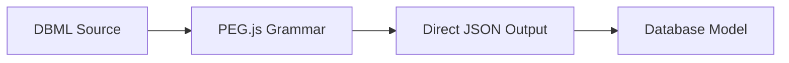
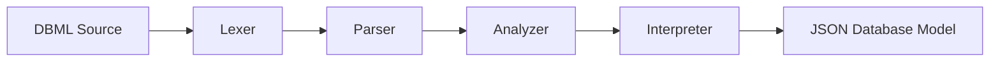

# RFC-20250115: DBML to JSON Database Model Parser

**Status**: IMPLEMENTED
**Last Updated**: 2025-01-15

## TLDR

The DBML to JSON parser transforms DBML (Database Markup Language) syntax into a structured JSON representation of database schemas, enabling programmatic manipulation and export to various database formats. This system implements a modern hand-written parser with generic grammar constructs that replaced the legacy PEG.js-based parser to support advanced IDE features and language extensibility.

## Concepts

- **DBML**: Domain-specific language for defining database schemas in a human-readable format
- **Raw Database Object**: Intermediate JSON representation containing tables, relationships, enums, and metadata
- **Database Model**: Internal object model with normalized relationships and type checking
- **Parser Pipeline**: Multi-stage processing from source text to structured data
- **AST (Abstract Syntax Tree)**: Hierarchical representation of parsed DBML syntax using generic constructs
- **Semantic Analysis**: Validation and reference resolution phase performed after parsing
- **Token Stream**: Sequence of lexical units extracted from source text
- **Generic Grammar**: Abstract syntax constructs that support multiple element types without parser modification
- **Element Declaration**: Generic `<type> <name> <block>` structure for Tables, Enums, Refs, etc.
- **Language Services**: IDE features like autocompletion, go-to-definition, and references

## High-level Architecture

The DBML to JSON parsing system consists of two distinct implementations:

### Legacy Parser (PEG.js)


### Modern Parser (@dbml/parse)


**Design Decisions:**

1. **Hand-Written Parser**: Provides precise control and easier maintenance compared to generated parsers
2. **Generic Grammar**: Uses common syntactic constructs (`<type> <name> <block>`) to support new elements without parser changes
3. **Modular Pipeline**: Separates lexing, parsing, analysis, and interpretation for better maintainability
4. **Language Services Support**: Designed to enable IDE features like autocompletion and go-to-definition
5. **Structured Error Handling**: Provides precise error locations and recovery mechanisms
6. **Backward Compatibility**: Legacy parser remains available as fallback (`dbml` vs `dbmlv2` format)

## Detailed Implementation

### Entry Point Architecture

The main parser class (`packages/dbml-core/src/parse/Parser.js`) acts as a dispatcher:

```javascript
class Parser {
  parse(str, format) {
    switch (format) {
      case 'dbml':
        return Parser.parseDBMLToJSON(str);      // Legacy parser
      case 'dbmlv2':
        return Parser.parseDBMLToJSONv2(str, this.DBMLCompiler); // New parser
      // ... other formats
    }
  }
}
```

### Legacy DBML Parser (PEG.js)

**Location**: `packages/dbml-core/src/parse/dbml/parser.pegjs`

**Key Features:**
- Grammar-based parsing using PEG.js
- Direct AST to JSON transformation
- Inline processing of table relationships
- Limited error recovery

**Output Structure:**
```javascript
{
  schemas: [],
  tables: [
    {
      name: "table_name",
      schemaName: null,
      fields: [
        {
          name: "field_name",
          type: { type_name: "int", args: null },
          pk: true,
          unique: false,
          not_null: true,
          // ... other constraints
        }
      ],
      indexes: [],
      token: { start: {...}, end: {...} }
    }
  ],
  refs: [],
  enums: [],
  tableGroups: [],
  project: {},
  aliases: []
}
```

### Modern DBML Parser (@dbml/parse)

**Location**: `packages/dbml-parse/src/`

The modern parser implements the generic grammar approach where common syntactic patterns are identified and parsed generically, with semantic analysis happening in later phases.

#### 1. Lexical Analysis (`src/lib/lexer/`)

Converts raw DBML text into tokens with precise position tracking:

```javascript
// Input: 'Table users { id int [pk] }'
// Output:
[
  { kind: 'IDENTIFIER', value: 'Table', position: {...} },
  { kind: 'IDENTIFIER', value: 'users', position: {...} },
  { kind: 'LBRACE', value: '{', position: {...} },
  { kind: 'IDENTIFIER', value: 'id', position: {...} },
  { kind: 'IDENTIFIER', value: 'int', position: {...} },
  { kind: 'LBRACKET', value: '[', position: {...} },
  // ...
]
```

#### 2. Syntax Analysis (`src/lib/parser/`)

Builds Abstract Syntax Tree from token stream:

```javascript
class Parser {
  private tokens: SyntaxToken[];
  private nodeFactory: NodeFactory;

  parse(): Report<{ ast: ProgramNode, tokens: SyntaxToken[] }, CompileError> {
    const body = this.program();
    const program = this.nodeFactory.create(ProgramNode, { body });
    return new Report({ ast: program, tokens: this.tokens }, this.errors);
  }
}
```

**AST Node Types (Generic Constructs):**
- `ProgramNode`: Root of the syntax tree containing element declarations
- `ElementDeclarationNode`: Generic `<type> <name> <block>` pattern for Tables, Enums, Refs, etc.
- `BlockExpressionNode`: Curly brace delimited content `{ ... }`
- `FunctionApplicationNode`: Settings and attributes `[setting: value]`
- `InfixExpressionNode`: Relationship operators `<`, `>`, `-`
- `PartialInjectionNode`: Table partial injection using `~partial_name`
- `TupleExpressionNode`: Parenthesized lists `(field1, field2)`

#### 3. Semantic Analysis (`src/lib/analyzer/`)

The analysis phase operates on the generic AST to provide meaning to the parsed structures:

```javascript
class Analyzer {
  analyze(): Report<ProgramNode, CompileError> {
    const validator = new Validator(this.ast, this.symbolFactory);
    return validator.validate().chain((program) => {
      const binder = new Binder(program);
      return binder.resolve(this.symbolFactory);
    });
  }
}
```

**Two-Stage Analysis:**

1. **Validation**: Checks element-specific rules based on the `type` field:
   - Table context validation (valid field definitions, index syntax)
   - Enum context validation (valid value definitions)
   - Ref context validation (proper endpoint syntax)
   - Setting value constraints and uniqueness

2. **Binding**: Resolves references and builds symbol table:
   - Table and column name resolution
   - Type references (enum types, table partials)
   - Cross-references between tables
   - Symbol table for IDE services

#### 4. Interpretation (`src/lib/interpreter/`)

Transforms the analyzed generic AST into the specific database model format:

```javascript
class Interpreter {
  interpret(): Report<Database, CompileError> {
    const errors = this.ast.body.flatMap((element) => {
      // Generic element dispatch based on type field
      switch (getElementKind(element).unwrap_or(undefined)) {
        case ElementKind.Table:
          return new TableInterpreter(element, this.env).interpret();
        case ElementKind.Ref:
          return new RefInterpreter(element, this.env).interpret();
        case ElementKind.Enum:
          return new EnumInterpreter(element, this.env).interpret();
        case ElementKind.Project:
          return new ProjectInterpreter(element, this.env).interpret();
        case ElementKind.TableGroup:
          return new TableGroupInterpreter(element, this.env).interpret();
        case ElementKind.TablePartial:
          return new TablePartialInterpreter(element, this.env).interpret();
        case ElementKind.Note:
          return new StickyNoteInterpreter(element, this.env).interpret();
        default:
          return []; // Unknown elements are ignored
      }
    });
    return new Report(convertEnvToDb(this.env), errors);
  }
}
```

**Element Interpreters**: Each interpreter handles the specific semantics of its element type:
- **TableInterpreter**: Processes fields, indexes, settings, and partial injections
- **RefInterpreter**: Handles relationship endpoints and settings
- **EnumInterpreter**: Processes enum values and settings
- **ProjectInterpreter**: Manages project-level configuration

### Database Model Construction

The parser output feeds into the Database model constructor:

```javascript
// packages/dbml-core/src/model_structure/database.js
class Database extends Element {
  constructor({
    schemas = [],
    tables = [],
    notes = [],
    enums = [],
    refs = [],
    tableGroups = [],
    project = {},
    // ...
  }) {
    // Process order is critical
    this.processNotes(notes);
    this.processSchemas(schemas);
    this.processSchemaElements(enums, ENUM);
    this.processSchemaElements(tables, TABLE);
    this.processSchemaElements(refs, REF);
    this.processSchemaElements(tableGroups, TABLE_GROUP);
  }
}
```

### JSON Output Format

The final JSON structure follows this normalized format:

```javascript
{
  // Core schema elements
  "schemas": [],
  "tables": [
    {
      "name": "users",
      "schemaName": null,
      "alias": null,
      "fields": [
        {
          "name": "id",
          "type": {
            "schemaName": null,
            "type_name": "int",
            "args": null
          },
          "pk": true,
          "unique": false,
          "not_null": true,
          "increment": false,
          "token": {
            "start": { "offset": 167, "line": 14, "column": 3 },
            "end": { "offset": 191, "line": 14, "column": 27 }
          }
        }
      ],
      "indexes": [],
      "partials": [],
      "headerColor": null,
      "token": { "start": {...}, "end": {...} }
    }
  ],
  "refs": [
    {
      "name": null,
      "schemaName": null,
      "endpoints": [
        {
          "fieldNames": ["id"],
          "tableName": "users",
          "schemaName": null,
          "relation": "1",
          "token": {...}
        }
      ],
      "token": {...}
    }
  ],
  "enums": [],
  "tableGroups": [],
  "aliases": [],
  "project": {},
  "tablePartials": []
}
```

### Error Handling

**Legacy Parser**: Basic syntax errors with limited context

**Modern Parser**: Structured error reporting:
```javascript
class CompileError {
  constructor(
    code: CompileErrorCode,
    message: string,
    nodeOrToken: SyntaxNode | SyntaxToken
  ) {
    this.code = code;
    this.message = message;
    this.location = {
      start: { line: ..., column: ... },
      end: { line: ..., column: ... }
    };
  }
}
```

### Integration Points

**CLI Integration**:
```javascript
// packages/dbml-cli/src/cli/export.js
const database = new Parser().parse(dbmlContent, 'dbmlv2');
const output = ModelExporter.export(database.normalize(), targetFormat);
```

**API Usage**:
```javascript
const { Parser } = require('@dbml/core');
const parser = new Parser();
const database = parser.parse(dbmlString, 'dbmlv2');
const jsonOutput = database.export();
```

### Performance Characteristics

**Memory Usage**:
- Legacy parser: Single-pass with minimal memory overhead
- Modern parser: Higher memory usage due to AST construction but enables incremental parsing

**Parse Speed**:
- Legacy: ~1000 lines/second for typical schemas
- Modern: ~500 lines/second but with better error recovery

**Error Recovery**:
- Legacy: Fails on first syntax error
- Modern: Continues parsing and reports multiple errors

### Testing Strategy

**Unit Tests**: Each parser stage tested independently
**Integration Tests**: End-to-end DBML to JSON conversion
**Snapshot Tests**: Output format validation
**Error Cases**: Malformed input handling

**Example Test**:
```javascript
// packages/dbml-parse/tests/interpreter/interpreter.test.ts
describe('#interpreter', () => {
  testNames.forEach((testName) => {
    const program = readFileSync(`./input/${testName}.in.dbml`, 'utf-8');
    const result = new Lexer(program)
      .lex()
      .chain(tokens => new Parser(tokens, nodeIdGenerator).parse())
      .chain(({ ast }) => new Analyzer(ast, symbolIdGenerator).analyze())
      .chain(ast => new Interpreter(ast).interpret());

    expect(result.getValue()).toMatchSnapshot();
  });
});
```

## Design Evolution

**Problem with Original Design (PEG.js)**:
- Inflexible grammar requiring modification for each new element type
- Limited language service support
- Difficult to extend and maintain
- Poor error recovery and reporting

**Current Design (Hand-written Generic Parser)**:
- Generic grammar using common syntactic constructs (`<type> <name> <block>`)
- Semantic analysis separated from parsing for flexibility
- Comprehensive language services support (autocompletion, go-to-definition, references)
- Robust error handling with precise locations
- Easy extensibility without parser modification

**Generic Grammar Benefits**:
- New element types can be added without changing the parser
- Common patterns: `Table`, `Enum`, `Ref` all use `<type> <name> <block>` structure
- Semantic rules are applied in later phases based on the `type` field
- Enables powerful language services through symbol table and reference tracking

**Key Improvements Over Legacy**:
- **Maintainability**: Hand-written parser is easier to understand and modify
- **Extensibility**: Generic constructs support new elements without grammar changes
- **IDE Features**: Precise position tracking enables advanced editor support
- **Error Recovery**: Continues parsing after errors to report multiple issues
- **Language Services**: Symbol resolution enables go-to-definition and autocompletion

**Lessons Learned**:
- Generic grammar design reduces parser complexity while maintaining flexibility
- Separating parsing from semantic analysis improves maintainability
- Position tracking is essential for IDE integration
- Hand-written parsers provide better control than generated alternatives
- Language services require careful symbol table design and reference tracking

## Related RFCs
- [RFC-20250115: DBML Lexer Implementation](rfc-20250115-dbml-lexer.md)