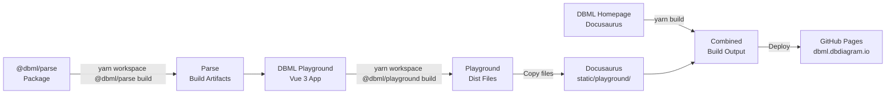

# RFC-20250722: DBML Playground Deployment

**Status**: IMPLEMENTED
**Last Updated**: 2025-07-23

## TLDR

- This RFC describes the deployment strategy for integrating the DBML Playground (Vue 3 SPA) into the DBML documentation site (Docusaurus) at `dbml.dbdiagram.io/playground`.
- Approach: uses static file serving to maintain simplicity while providing a seamless user experience across both applications.

## Concepts

- **Static Site Deployment**: Both the documentation site and playground are served as static files without server-side rendering
- **Base Path Configuration**: Vue applications can be configured to run under a subdirectory using Vite's configuration
- **Docusaurus Static Directory**: Files placed in the `static/` directory are copied as-is to the build output
- **GitHub Pages**: Static hosting service that serves the combined documentation and playground
- **Monorepo Workspace Resolution**: Yarn workspaces automatically resolve local packages instead of published npm versions

## High-level Architecture

### Design Decisions

1. **Static File Approach**: Serve the dbml playground static files under the static (public) folder of the dbml homepage
2. **Separate Build Processes**: Each application maintains its own build pipeline before integration
3. **External Tab Navigation**: Playground opens in a new tab to maintain separate application contexts and utilize the html reload
4. **Single Domain Serving**: Both applications served from same domain to avoid CORS issues
5. **Monorepo Build Dependencies**: Build `@dbml/parse` package first due to yarn workspace resolution linking to local packages instead of npm versions

### System Architecture



### URL Structure

- Documentation: `https://dbml.dbdiagram.io/`
- Playground: `https://dbml.dbdiagram.io/playground/`

## Detailed Implementation

### 1. Playground Configuration

**File**: `dbml-playground/vite.config.ts`

```typescript
export default defineConfig({
  base: '/playground/',  // Configure base path
  // ... rest of config
})
```

This ensures all asset paths (JS, CSS, images) are relative to `/playground/`.

### 2. Build and Copy Process

**Build Script** (to be added to CI/CD):

```bash
# Build playground
cd dbml-playground
npm install
npm run build

# Copy to documentation static directory
cd ../dbml-homepage
rm -rf static/playground  # Clean previous build
cp -r ../dbml-playground/dist static/playground
```

### 3. Navigation Integration

**File**: `dbml-homepage/configs/navbar.ts`

```typescript
{
  href: '/playground',
  label: 'Playground',
  position: 'left',
  target: '_blank',  // Opens in new tab
}
```

### 4. CI/CD Pipeline Implementation

The GitHub Actions workflows implement the deployment strategy with proper build order and caching optimizations:

**Production Deployment**: `.github/workflows/deploy-docs.yml`

**Pull Request Testing**: `.github/workflows/build-docs.yml`

- Same build steps as production deployment
- Triggered on PR changes to `dbml-homepage/**`, `dbml-playground/**`
- Validates build without deployment

### File Structure

```text
dbml-homepage/
├── static/
│   └── playground/        # Copied playground build
│       ├── index.html
│       ├── assets/
│       │   ├── index-[hash].js
│       │   └── index-[hash].css
│       └── dbml-favicon.svg
└── build/                 # Final output
    └── playground/        # Served at /playground
```

## Limitations and Known Issues

### Current Limitations

1. **Manual Build Coordination**: Playground must be built before documentation
2. **Version Synchronization**: No automatic version alignment between playground and parser
3. **Development Workflow**: Local development requires manual build and copy steps

### Technical Constraints

1. **No Server-Side Routing**: Pure static hosting limits dynamic routing options
2. **Build Size**: Combined build includes both applications' assets
3. **Cross-App Communication**: No direct communication between documentation and playground

### Workarounds

1. **Development Script**: Create npm script to automate local build and copy
2. **Version Display**: Show DBML parser version in playground UI

### Future Improvements

1. **Shared Components**: Extract common UI elements (navbar, footer)
2. **Development Proxy**: Configure Docusaurus dev server to proxy playground requests

## Security Considerations

1. **Client-Side Only**: All parsing happens in browser, no server-side execution
2. **No Data Storage**: Playground doesn't persist user data
3. **Static Assets**: All files served as static assets with no dynamic generation

## Deployment Process

1. **Pull Request**: Changes trigger preview build
2. **Merge to Master**: Manually triggers production deployment
3. **Build Order**: Playground → Documentation → Deploy
4. **Rollback**: Revert commit and redeploy

## Monitoring

1. **Build Status**: GitHub Actions workflow status

## Design Evolution

### Key Implementation Changes

During implementation, several important discoveries were made that differed from the original design:

#### 1. Monorepo Build Dependencies Discovery

**Original Design**: Assumed playground could be built independently using published npm packages.

**Reality**: Yarn workspace resolution automatically links to local `@dbml/parse` package, requiring explicit build order.

**Impact**: Added mandatory `yarn workspace @dbml/parse build` step before playground build to ensure proper module resolution.

#### 2. CI/CD Performance Enhancements

**Added**: Node modules caching for both root and homepage dependencies

- Root cache: `node_modules` and `.yarn/cache`
- Homepage cache: `dbml-homepage/node_modules` and `dbml-homepage/.yarn/cache`
- Significant build time reduction for repeated deployments

### Lessons Learned

1. **Monorepo Complexity**: Workspace dependency resolution requires careful build ordering
2. **Performance Matters**: Caching strategies are essential for CI/CD efficiency
3. **Build Validation**: PR builds should mirror production builds exactly
4. **Error Isolation**: Clear job names and steps improve debugging experience
