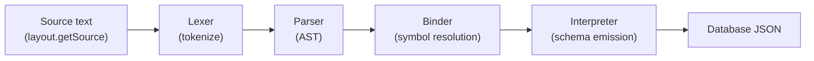
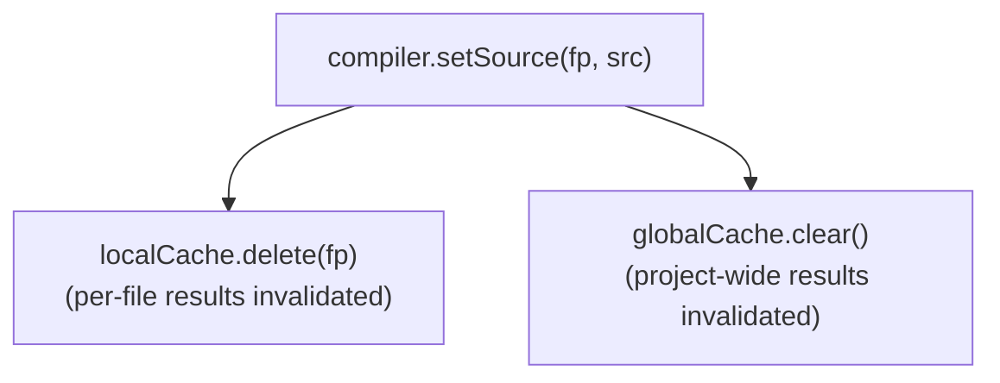
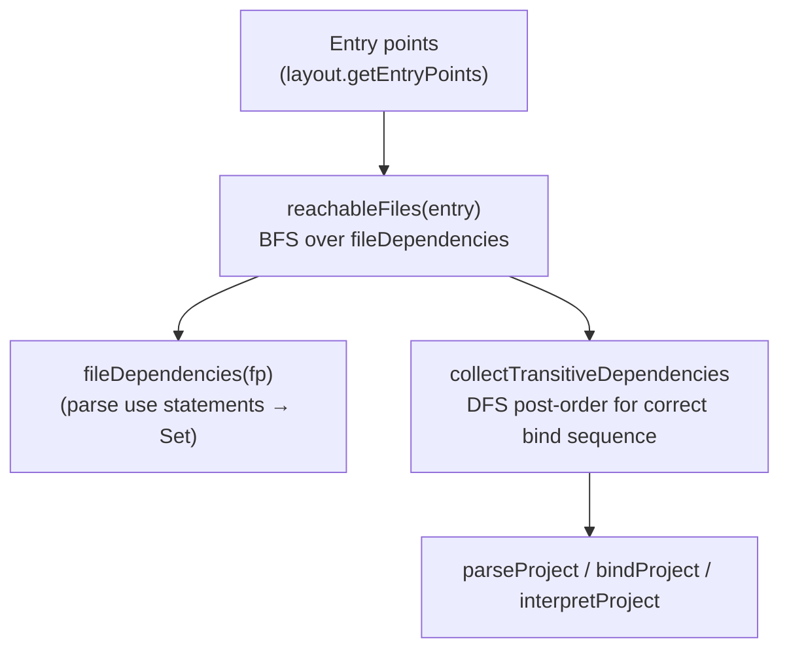
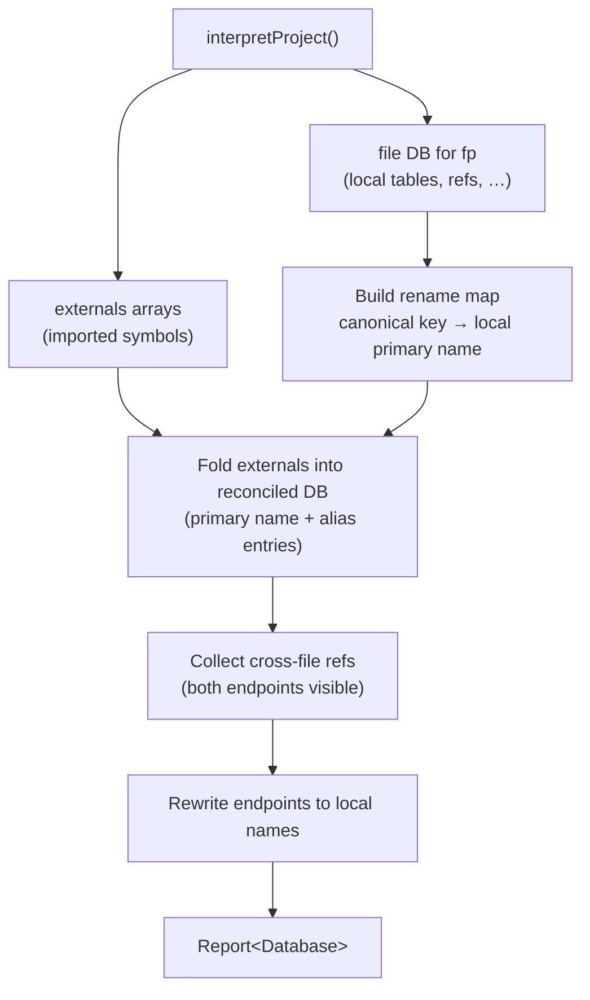

# @dbml/parse

The core DBML compiler for the [dbml](https://dbml.dbdiagram.io) ecosystem.

`@dbml/parse` is a **query-based, incremental compiler** that turns `.dbml` source files — including multi-file projects — into a structured in-memory database model. It powers the language-services (completion, go-to-definition, diagnostics, references) used by the playground and IDE extensions.

---

## Table of Contents

- [Installation](#installation)
- [Quick start](#quick-start)
- [Architecture overview](#architecture-overview)
  - [Project layout](#project-layout)
  - [Three-stage pipeline](#three-stage-pipeline)
  - [Query caching](#query-caching)
- [Multi-file support](#multi-file-support)
  - [use vs reuse](#use-vs-reuse)
  - [Dependency traversal](#dependency-traversal)
  - [exportSchemaJson vs interpretProject](#exportschemajson-vs-interpretproject)
- [API reference](#api-reference)
  - [Compiler](#compiler)
  - [DbmlProjectLayout](#dbmlprojectlayout)
  - [MemoryProjectLayout](#memoryprojectlayout)
  - [Filepath](#filepath)
  - [Report\<T\>](#reportt)
  - [Transform queries](#transform-queries)
- [Language services](#language-services)
- [Legacy API](#legacy-api)

---

## Installation

```bash
npm install @dbml/parse
```

---

## Quick start

### Single file

```ts
import { Compiler, DEFAULT_ENTRY } from '@dbml/parse';

const compiler = new Compiler();
compiler.setSource(DEFAULT_ENTRY, `
Table users {
  id   int [pk]
  name varchar
}
`);

const result = compiler.exportSchemaJson(DEFAULT_ENTRY);
// result.getErrors()  → CompileError[]
// result.getValue()   → Database | undefined
```

### Multi-file project

```ts
import { Compiler, MemoryProjectLayout, Filepath } from '@dbml/parse';

const layout = new MemoryProjectLayout();
layout.setSource(Filepath.from('/types.dbml'), `
Enum job_status { active inactive }
`);
layout.setSource(Filepath.from('/main.dbml'), `
use { enum job_status } from './types.dbml'
Table jobs { id int [pk]  status job_status }
`);

const compiler = new Compiler();
compiler.layout = layout;

const result = compiler.exportSchemaJson(Filepath.from('/main.dbml'));
```

---

## Architecture overview

### Project layout

A `DbmlProjectLayout` is an abstract view of the filesystem. The compiler never reads the real disk — it only calls layout methods. This makes incremental edits cheap and keeps the compiler environment-agnostic.

```ts
interface DbmlProjectLayout {
  setSource   (filePath: Filepath, content: string): void;
  getSource   (filePath: Filepath): string | undefined;
  deleteSource(filePath: Filepath): void;
  clearSource (): void;
  exists      (filePath: Filepath): boolean;
  listDirectory(dirPath?: Filepath): Filepath[];
  getEntryPoints(): Filepath[];
}
```

Two implementations ship out of the box:

| Class | Use case |
|---|---|
| `MemoryProjectLayout` | Tests, in-memory pipelines, playground |
| `NodeProjectLayout` (in `@dbml/cli`) | Node.js filesystem, with in-memory overlay for unsaved edits |

### Three-stage pipeline

Every file travels through three stages before becoming schema JSON:



| Stage | Query | Output |
|---|---|---|
| Parse | `parseFile(fp)` | `FileParseIndex` — AST + token stream |
| Bind | `bindFile(fp)` | Populates symbol table; resolves `use` imports |
| Interpret | `interpretFile(fp)` | `Database` per file (raw, unexported symbols) |

`exportSchemaJson(fp)` orchestrates all three stages across all reachable files and reconciles the result for a single entry point (see [exportSchemaJson vs interpretProject](#exportschemajson-vs-interpretproject)).

### Query caching

The compiler uses a **two-tier memoisation** strategy so that editing one file only recomputes the minimum set of results:



| Cache tier | Scope | Invalidated when |
|---|---|---|
| `localCache` | One file, one query, one argument set | That file's source changes |
| `globalCache` | Whole project, one query, one argument set | **Any** file changes |

`parseFile` is a *local query* — its result is keyed by filepath, so changing `/b.dbml` never evicts the cached parse of `/a.dbml`.

Every other query (`bindFile`, `interpretFile`, `exportSchemaJson`, symbol lookups, …) is a *global query* — they depend on the full project graph and are always cleared together.

Cycle detection is built in: if a query calls itself recursively (e.g. a circular `use` chain), the cache throws instead of looping infinitely.

---

## Multi-file support

### use vs reuse

DBML supports two import keywords with distinct visibility semantics:

| Keyword | What it does |
|---|---|
| `use { table T } from './other.dbml'` | **Selective import** — brings `T` into scope locally only; it is not re-exported to files that import this file |
| `use * from './other.dbml'` | **Wildcard import** — brings every exportable symbol from `other.dbml` into local scope |
| `reuse * from './shared.dbml'` | **Re-export** — brings symbols into local scope AND makes them available to files that import this file |

Example:

```
// shared.dbml
Table users { id int }

// lib.dbml
reuse * from './shared.dbml'   // users is now re-exported by lib.dbml

// main.dbml
use * from './lib.dbml'        // users is visible here (pulled through the reuse chain)
```

### Dependency traversal



1. **`fileDependencies(fp)`** — local query. Parses the AST of `fp` and returns the set of files it directly imports via `use … from`.
2. **`reachableFiles(entry)`** — local query. BFS from `entry` over `fileDependencies`; returns the full transitive closure as a `Set<Filepath>`.
3. **`collectTransitiveDependencies(compiler, entries)`** — helper. DFS post-order traversal so every file's dependencies are processed before the file itself, satisfying the binder's forward-reference requirement.

### exportSchemaJson vs interpretProject

| | `interpretProject()` | `exportSchemaJson(fp)` |
|---|---|---|
| **Returns** | `Report<MasterDatabase>` — `{ files, items }` | `Report<Database>` — single reconciled view |
| **Scope** | All entry points merged flat | One file's view, including visible imports |
| **External symbols** | Raw `externals` arrays (unresolved aliases) | Reconciled: externals are folded in, aliases applied, ref endpoints rewritten to local names |
| **Use case** | Tooling that needs all files at once | CLI export, schema generation for one file |

`exportSchemaJson` reconciliation logic:



---

## API reference

### Compiler

```ts
import { Compiler } from '@dbml/parse';
const compiler = new Compiler();
```

`Compiler` is the main entry point. All public methods are memoised queries.

**Source management**

| Method | Description |
|---|---|
| `compiler.setSource(fp, src)` | Add or update a file. Invalidates localCache for `fp` and clears globalCache. |
| `compiler.deleteSource(fp)` | Remove a file. Same invalidation rules as `setSource`. |
| `compiler.clearSource()` | Reset layout and both caches. |
| `compiler.layout` | Assignable `DbmlProjectLayout`. Replace to point the compiler at a different set of files. |

**Pipeline queries**

| Query | Type | Description |
|---|---|---|
| `parseFile(fp)` | local | Lex + parse one file → `Report<FileParseIndex>` |
| `parseProject()` | global | Parse all entry-point files → `Map<string, Report<FileParseIndex>>` |
| `bindFile(fp)` | global | Bind one file (populate symbol table) → `Report<void>` |
| `bindProject()` | global | Bind all files in dependency order → `Map<string, Report<void>>` |
| `interpretFile(fp)` | global | Interpret one file → `Report<Database \| undefined>` |
| `interpretProject()` | global | Interpret all files, merge → `Report<MasterDatabase>` |
| `exportSchemaJson(fp)` | global | Reconciled single-file view → `Report<Database \| undefined>` |

**Symbol queries**

| Query | Description |
|---|---|
| `nodeSymbol(node)` | Resolve the symbol declared by `node` |
| `symbolMembers(symbol)` | Direct child symbols |
| `lookupMembers(symbolOrNode, kind, name)` | Find a named member by kind |
| `nodeReferee(node)` | What symbol does a reference node point to? |
| `symbolReferences(symbol)` | All AST nodes that reference a symbol |

**Graph queries**

| Query | Description |
|---|---|
| `fileDependencies(fp)` | Direct imports of `fp` → `Set<string>` |
| `reachableFiles(entry)` | BFS transitive closure from `entry` → `Set<Filepath>` |
| `topLevelSchemaMembers(fp)` | Top-level schema symbols declared in `fp` |
| `fileUsableMembers(symbolOrFp)` | Importable members (non-schema, schema, reuses, uses) |

### DbmlProjectLayout

The interface the compiler uses to read source files. Implement this to back the compiler with any storage layer (filesystem, LSP workspace, in-memory store, etc.).

`clearSource()` must **not** reset entry points; it only clears file contents.

### MemoryProjectLayout

```ts
import { MemoryProjectLayout, Filepath } from '@dbml/parse';

const layout = new MemoryProjectLayout();
layout.setSource(Filepath.from('/main.dbml'), 'Table users { id int }');

// or initialise from a plain object:
const layout2 = new MemoryProjectLayout({ '/main.dbml': 'Table users { id int }' });
```

`getEntryPoints()` returns all files in alphabetical order.

### Filepath

```ts
import { Filepath } from '@dbml/parse';

const fp = Filepath.from('/main.dbml');
fp.absolute   // '/main.dbml'
fp.basename   // 'main.dbml'
fp.intern()   // interned string ID (stable across calls for the same path)
```

Paths are **always absolute** (rooted at `/`). Relative import paths in `use` statements are resolved against the importing file's directory.

### Report\<T\>

All compiler queries return a `Report<T>` — a monadic container that carries a value, errors, and warnings together:

```ts
const result = compiler.exportSchemaJson(entry);

result.getValue()     // T | undefined — the computed value (may be undefined on error)
result.getErrors()    // CompileError[]
result.getWarnings()  // CompileWarning[]

// Chaining — if this report has errors, the chain short-circuits
result.chain((value) => anotherReport)
result.map((value) => transformed)
```

### Transform queries

Higher-level text-transform helpers that produce edited DBML source strings.

#### `compiler.renameTable(filepath, oldName, newName)`

Renames a table (and all its references in the same file) without re-parsing the whole project.

```ts
const newSource = compiler.renameTable(
  Filepath.from('/main.dbml'),
  'users',          // or { schema: 'auth', table: 'users' }
  'customers',
);
```

- Preserves quoting style of the original declaration.
- No-ops when `oldName` is not found or `newName` already exists.
- Returns the original source unchanged on any error.

> **Note:** `renameTable` currently only rewrites references within the **default entry file** (`parse.source()`). Cross-file references are not yet updated.

#### `syncDiagramView(source, operations)`

Applies a sequence of create / update / delete operations to a DBML string's `DiagramView` blocks.

```ts
import { syncDiagramView } from '@dbml/parse';

const { newDbml } = syncDiagramView(source, [
  { operation: 'create', name: 'main',   visibleEntities: { tables: null, stickyNotes: null, tableGroups: null, schemas: null } },
  { operation: 'update', name: 'main',   newName: 'overview' },
  { operation: 'delete', name: 'old_view' },
]);
```

- **create** is idempotent: if a block with the same name already exists it is replaced in-place; otherwise the block is appended.
- **update** renames only the name token; block body is preserved.
- **delete** removes the whole block (no-op when not found).

---

## Language services

`@dbml/parse` exposes four Monaco-compatible language service providers:

```ts
import {
  DBMLCompletionItemProvider,
  DBMLDefinitionProvider,
  DBMLReferencesProvider,
  DBMLDiagnosticsProvider,
} from '@dbml/parse';

const compiler = new Compiler();
// ... load sources ...

const services = await compiler.initMonacoServices();
// services.autocompletionProvider
// services.definitionProvider
// services.referenceProvider
// services.diagnosticsProvider
```

---

## Legacy API

The `compiler.parse.*` namespace exposes a compatibility surface for consumers that were written against the old single-file API. These are **deprecated** and will be removed in a future version.

```ts
compiler.parse.source()          // source of DEFAULT_ENTRY (/main.dbml)
compiler.parse.ast()             // AST of DEFAULT_ENTRY
compiler.parse.errors()          // errors for DEFAULT_ENTRY
compiler.parse.warnings()        // warnings for DEFAULT_ENTRY
compiler.parse.tokens()          // token stream of DEFAULT_ENTRY
compiler.parse.rawDb()           // raw Database for DEFAULT_ENTRY
compiler.parse.publicSymbolTable() // symbol table for DEFAULT_ENTRY
```

All legacy methods are hardcoded to `DEFAULT_ENTRY = Filepath.from('/main.dbml')`. For multi-file projects, use the pipeline queries directly.
